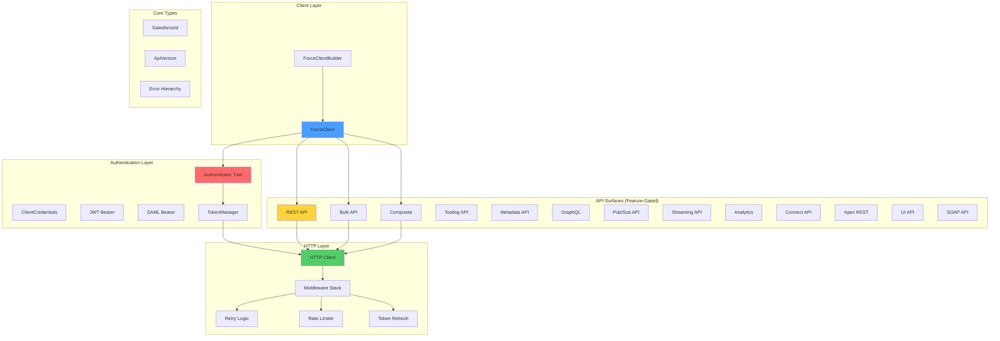
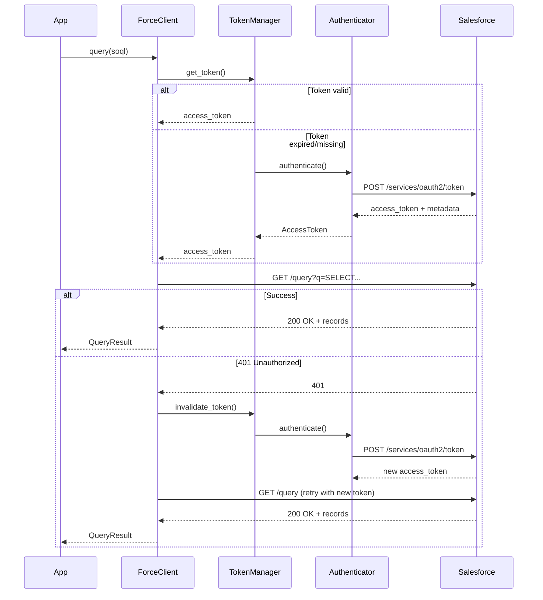

# force-rs

> Canonical Salesforce Platform API client for Rust

## Vision

`force-rs` is a production-grade, feature-gated Rust client for the Salesforce Platform API ecosystem. It provides zero-cost abstractions, compile-time safety guarantees, and TDD-driven reliability for integrating with all 15+ Salesforce API surfaces.

## Project Status

🚧 **Foundation Phase** - Building core authentication and HTTP infrastructure with strict TDD discipline.

Current milestone: Authentication layer and type system foundation

## Architecture Overview



## Core Design Principles

### 1. Feature-Gated Zero-Cost Abstractions
Only compile what you use. Each API surface is behind a feature flag:
- `rest` (default) - REST API
- `tooling` - Tooling API (independent of `rest`)
- `bulk` - Bulk API 2.0
- `composite` - Composite API
- `ui` - UI API (layout-aware records, metadata, list views, favorites)
- `graphql` - GraphQL API (queries, mutations, variables)
- `data_cloud` - Data Cloud REST Connect API (SQL queries, two-step token exchange)
- `apex_rest` - Generic Apex REST API (custom `/services/apexrest/` endpoints)
- `cpq` - Salesforce CPQ API (quote lifecycle, product config, documents, amendments)
- `consent` - Consent & Portability API (GDPR/CCPA consent checks, data export)
- `jwt` - JWT Bearer authentication flow
- `username_password` - Username-password flow (deprecated by Salesforce, feature-gated as speed bump)
- `pub_sub` - gRPC Pub/Sub API (separate `force-pubsub` crate)
- `full` - All common features (rest + tooling + bulk + composite + jwt + ui + graphql + data_cloud + apex_rest)
- `all` - Everything including specialized APIs (+ cpq)

### 2. Compile-Time Auth Safety (Phantom Type State Pattern)
The builder uses phantom types to enforce authentication at compile time:
```rust
// Won't compile - client requires authentication
let client = ForceClient::builder()
    .instance_url("https://na1.salesforce.com")
    .build(); // ERROR: No method `build` on ForceClientBuilder<Unauthenticated>

// Compiles - type state transitions to Authenticated<ClientCredentials>
let client = ForceClient::builder()
    .instance_url("https://na1.salesforce.com")
    .with_client_credentials("client_id", "client_secret")  // Transitions state
    .build()?; // OK: ForceClient<ClientCredentials>
```
See [ADR-005](docs/adr/005-compile-time-auth-safety.md) for phantom type design details.

### 3. Handler Pattern for API Organization
API operations are accessed through lightweight handler objects for clear namespacing:
```rust
use force::api::rest_operation::RestOperation; // Required for CRUD/Query/Describe

// REST API operations
let accounts = client.rest().query("SELECT Id FROM Account").await?;
let contact_id = client.rest().create("Contact", &data).await?;

// Tooling API operations (feature: tooling) - same trait, different URL prefix
let classes = client.tooling().query("SELECT Id FROM ApexClass").await?;
let result = client.tooling().execute_anonymous("System.debug('hi');").await?;

// Bulk API operations (feature: bulk)
let job = client.bulk().query("SELECT Id FROM Contact").await?;

// Composite API operations (feature: composite)
let result = client.composite().request(composite_req).await?;

// Apex REST operations (feature: apex_rest) - custom Apex REST endpoints
let data: Value = client.apex_rest().post("MyNamespace/MyEndpoint", &body).await?;

// CPQ operations (feature: cpq) - typed Salesforce CPQ API
let quote = client.cpq().read_quote("a0x000000000001AAA").await?;
let calculated = client.cpq().calculate_quote(&quote).await?;

// Consent operations (feature: consent) - GDPR/CCPA compliance
let consent = client.consent().read_consent("email", &["001xx..."]).await?;
```
See [ADR-006](docs/adr/006-handler-pattern.md) for handler pattern rationale.
See [ADR-019](docs/adr/019-tooling-api-design.md) for the `RestOperation` trait extraction.
See [ADR-023](docs/adr/023-apex-rest-cpq-design.md) for the Apex REST + CPQ layered design.

### 4. TDD RED-GREEN-REFACTOR
Every feature follows strict test-driven development:
1. **RED** - Write failing test first
2. **GREEN** - Minimal implementation to pass
3. **REFACTOR** - Clean up while tests stay green

No production code without a test driving it.

### 5. Strong Typing & Semantic Safety
```rust
// Bad - primitives hide intent
fn query(id: String, version: String) -> Result<()>

// Good - newtypes enforce correctness
fn query(id: SalesforceId, version: ApiVersion) -> Result<()>
```

### 6. Error Handling Philosophy
- `thiserror` for library errors (this crate)
- Clear error hierarchy with context
- No `unwrap()` or `expect()` in production code
- Errors map to HTTP status codes and Salesforce error responses

## Module Structure

```
crates/force/src/
├── lib.rs                  # Public API surface
├── types/
│   ├── mod.rs
│   ├── salesforce_id.rs   # SalesforceId newtype (15/18 char validation)
│   └── api_version.rs     # ApiVersion newtype (v67.0 format)
├── error/
│   ├── mod.rs             # Error hierarchy
│   ├── auth_error.rs
│   ├── http_error.rs
│   └── api_error.rs
├── auth/
│   ├── mod.rs
│   ├── traits.rs          # Authenticator trait
│   ├── token.rs           # AccessToken, TokenManager
│   ├── client_credentials.rs
│   ├── jwt_bearer.rs      # Feature-gated: jwt
│   └── saml_bearer.rs     # Feature-gated: jwt
├── http/
│   ├── mod.rs
│   ├── client.rs          # HTTP layer with middleware
│   ├── retry.rs           # Exponential backoff
│   ├── rate_limit.rs      # 429 handling
│   └── middleware.rs      # 401 token refresh
├── client/
│   ├── mod.rs
│   ├── force_client.rs    # ForceClient<Auth>
│   ├── builder.rs         # ForceClientBuilder
│   └── config.rs          # ClientConfig, Environment
└── api/
    ├── rest/              # Feature: rest (default)
    ├── bulk/              # Feature: bulk
    ├── composite/         # Feature: composite
    ├── tooling/           # Feature: tooling
    ├── ui/                # Feature: ui
    │   ├── mod.rs         # UiHandler + HTTP helpers
    │   ├── types.rs       # FieldValueRepresentation, LayoutType, Mode
    │   ├── records.rs     # record_ui, get/create/update/delete_record, defaults
    │   ├── object_info.rs # object_info, object_infos_batch
    │   ├── layouts.rs     # layout
    │   ├── list_views.rs  # list_ui, list_views, list_records, list_info
    │   ├── actions.rs     # record_actions
    │   ├── lookups.rs     # lookup, filtered_lookup
    │   └── favorites.rs   # get/create/update/delete favorites
    ├── graphql/           # Feature: graphql
    │   ├── mod.rs         # GraphqlHandler + query methods + URL resolver
    │   ├── types.rs       # GraphqlRequest, GraphqlResponse, GraphqlError
    │   └── error.rs       # GraphqlErrorResponse wrapper
    ├── data_cloud/        # Feature: data_cloud
    │   ├── mod.rs         # DataCloudHandler + URL resolution (ssot/) + HTTP helpers
    │   ├── types.rs       # SqlQueryRequest, DataCloudRecord, ColumnMetadata
    │   └── query.rs       # SQL query endpoint (query_sql)
    ├── apex_rest/         # Feature: apex_rest
    │   └── mod.rs         # ApexRestHandler + resolve_apex_rest_url + HTTP methods
    ├── cpq/               # Feature: cpq (depends on apex_rest)
    │   ├── mod.rs         # CpqHandler + ServiceRouter dispatch helpers
    │   ├── types.rs       # QuoteModel, QuoteLineModel, ProductModel, ConfigurationModel
    │   ├── error.rs       # CpqErrorResponse
    │   ├── quote.rs       # read_quote, save_quote, calculate_quote, add_products
    │   ├── product.rs     # load_product
    │   ├── config.rs      # load_config, validate_config
    │   ├── document.rs    # generate_document
    │   └── contract.rs    # amend_contract
    ├── consent/           # Feature: consent
    │   ├── mod.rs         # ConsentHandler + URL resolvers
    │   ├── types.rs       # ConsentValue, ConsentRecord, PortabilityRequest/Response
    │   ├── action.rs      # read_consent, read_consent_multi
    │   └── portability.rs # request_portability, check_portability_status
    └── ...                # Other API surfaces
```

## Authentication Flows



## Development Workflow

### Prerequisites
```bash
rustc 1.85+ (edition 2024)
cargo-watch
cargo-nextest (recommended)
```

### Running Tests
```bash
# Run all tests with nextest
cargo nextest run

# Run with coverage
cargo tarpaulin --workspace --out Lcov

# Run specific feature tests
cargo test --features jwt
cargo test --features bulk
```

### Code Quality
```bash
# Format (required before commit)
cargo fmt --all

# Lint with pedantic + nursery
cargo clippy --workspace --all-features -- -D warnings

# Check docs
cargo doc --no-deps --all-features
```

### Pre-Commit Checklist
- [ ] `cargo fmt` passes
- [ ] `cargo clippy` passes with no warnings
- [ ] `cargo test` passes (all features)
- [ ] Test coverage >= 85%
- [ ] New public APIs have doc comments
- [ ] ADR created for architectural decisions

## Testing Strategy

### Unit Tests
- Co-located with implementation in each module
- Use TDD RED-GREEN-REFACTOR cycle
- Mock external dependencies

### Integration Tests
```
tests/
├── auth_flows.rs          # End-to-end auth flows
├── rest_api.rs            # REST API integration
└── common/
    └── fixtures.rs        # Shared test fixtures
```

### Test Doubles
```rust
// Feature-gated mock support
#[cfg(feature = "mock")]
use force::testing::{MockForceClient, MockAuthenticator};
```

## Feature Roadmap

### Phase 1: Foundation ✓ COMPLETE
- [x] Workspace structure with lints
- [x] Core types (SalesforceId, ApiVersion)
- [x] Error hierarchy with thiserror
- [x] Authenticator trait
- [x] AccessToken & TokenManager
- [x] HTTP layer with reqwest
- [x] ForceClient with compile-time auth safety

### Phase 2: Core Auth Flows
- [x] Client credentials flow (OAuth 2.0)
- [x] JWT bearer flow (feature: jwt)
- [x] Username-password flow (feature: username_password) - See [ADR-025](docs/adr/025-username-password-auth.md)
  - [x] Password grant with security_token concatenation
  - [x] Refresh token storage and rotation
  - [x] Graceful fallback to re-auth on revoked tokens
- [ ] SAML bearer flow (feature: jwt)
- [x] Refresh token support (in UsernamePassword authenticator)

### Phase 3: REST API (Default Feature) - COMPLETE
- [x] RestHandler foundation
- [x] Org Limits API (see `examples/org_limits.rs`)
- [x] Query types (QueryResult, DynamicSObject)
- [x] Query (SOQL) - See `examples/soql_query.rs`
- [x] QueryMore (pagination)
- [x] CRUD operations - See `examples/basic_crud.rs`
  - [x] Create
  - [x] Read (Get)
  - [x] Update
  - [x] Delete
  - [x] Upsert
- [x] Search (SOSL) - See `examples/search.rs`
- [x] Describe (metadata) - See `examples/describe.rs`
  - [x] Describe Global
  - [x] Describe SObject

### Phase 4: Advanced APIs
- [x] Bulk API 2.0 (feature: bulk)
- [x] Composite API (feature: composite)
- [x] Tooling API (feature: tooling) - See [ADR-019](docs/adr/019-tooling-api-design.md)
  - [x] `RestOperation` trait extraction (shared CRUD/Query/Describe)
  - [x] Execute Anonymous Apex
  - [x] Run Tests (sync + async)
  - [x] Code Completions
- [x] UI API (feature: ui) - See [ADR-020](docs/adr/020-ui-api-design.md)
  - [x] Record CRUD + record-ui aggregation + defaults (8 endpoints)
  - [x] Object metadata (2 endpoints)
  - [x] Page layouts (1 endpoint)
  - [x] List views (4 endpoints)
  - [x] Record actions (1 endpoint)
  - [x] Lookup type-ahead (2 endpoints)
  - [x] Favorites CRUD (4 endpoints)
- [x] GraphQL API (feature: graphql) - See [ADR-021](docs/adr/021-graphql-api-design.md)
  - [x] GraphqlHandler with custom deserialization pipeline
  - [x] query<T> (typed, errors-as-Result)
  - [x] query_with_errors<T> (full envelope for partial success)
  - [x] query_raw (convenience string → Value)
  - [x] GraphqlRequest builder (new + with_variables + with_operation_name)
  - [x] GraphqlErrorResponse → ForceError::GraphQL conversion
- [x] Data Cloud REST Connect API (feature: data_cloud) - See [ADR-022](docs/adr/022-data-cloud-api-design.md)
  - [x] DataCloudAuthenticator decorator (two-step token exchange)
  - [x] DataCloudHandler with `ssot/` URL prefix
  - [x] SQL Query endpoint (query_sql)
  - [x] Builder integration (.with_data_cloud())
- [x] Apex REST API (feature: apex_rest) - See [ADR-023](docs/adr/023-apex-rest-cpq-design.md)
  - [x] ApexRestHandler with public GET/POST/PATCH/PUT/DELETE methods
  - [x] `resolve_apex_rest_url` on Session (version-less URL construction)
  - [x] Generic access to any `/services/apexrest/{path}` endpoint
- [x] CPQ API (feature: cpq, depends on apex_rest) - See [ADR-023](docs/adr/023-apex-rest-cpq-design.md)
  - [x] CpqHandler with ServiceRouter dispatch (POST + PATCH)
  - [x] Quote lifecycle: read_quote, save_quote, calculate_quote, add_products
  - [x] Product loading: load_product
  - [x] Configuration: load_config, validate_config
  - [x] Document generation: generate_document
  - [x] Contract amendment: amend_contract
  - [x] Typed models: QuoteModel, QuoteLineModel, ProductModel, ConfigurationModel
  - [x] ServiceRouterRequest with double-serialized JSON envelope
- [x] Consent & Portability API (feature: consent) - See [ADR-024](docs/adr/024-consent-portability-api-design.md)
  - [x] ConsentHandler with consent + portability URL resolution
  - [x] Consent reads: read_consent (single action), read_consent_multi (multiple actions)
  - [x] Portability: request_portability, check_portability_status
  - [x] Typed ConsentValue enum (Yes/No/Unknown) with fail-safe deserialization

### Phase 5: Specialized Features
- [ ] Pub/Sub API via gRPC (feature: pub_sub)
- [ ] Streaming API (feature: streaming)
- [ ] SOAP API (feature: soap)
- [x] Marketing Cloud Engagement REST API (sibling crate: `force-marketingcloud`) - See [ADR-027](docs/adr/027-marketing-cloud-engagement-crate.md)
  - [x] Installed-Package server-to-server (JSON client credentials) auth
  - [x] Proactive, per-business-unit (MID) token cache with single-flight refresh
  - [x] Transactional Messaging (email/SMS send + status)
  - [x] Content Builder Assets (create/get/update/delete/list)
  - [x] Contacts (create, delete by key)
  - [x] Data Extensions (sync rowset upsert, async insert, row query)
  - [x] Journeys / Interaction (list, fire entry event)
  - [x] Raw escape hatch; SOAP deferred as a follow-up

## Configuration

### Environment-Based Config
```rust
use force::{Environment, ForceClient};

let client = ForceClient::builder()
    .environment(Environment::Production)  // or Sandbox, Custom
    .with_client_credentials("client_id", "client_secret")
    .build()?;
```

### Manual Config
```rust
use force::{ClientConfig, ForceClient};

let config = ClientConfig::builder()
    .instance_url("https://custom.my.salesforce.com")
    .api_version("v67.0")
    .timeout_seconds(30)
    .max_retries(3)
    .build()?;

let client = ForceClient::with_config(config)
    .with_jwt_bearer(jwt_config)
    .build()?;
```

## Performance Considerations

### Connection Pooling
- `reqwest` connection pool (default: 10 connections)
- Configurable via `ClientConfig`

### Rate Limiting
- Automatic 429 retry with exponential backoff
- Respects `Retry-After` headers
- Per-org rate limits (24-hour rolling window)

### Timeout Strategy
```rust
ClientConfig::builder()
    .connect_timeout(5)      // Connection timeout
    .request_timeout(30)     // Request timeout
    .build()
```

## Security

### Credential Management
```rust
use secrecy::{Secret, ExposeSecret};

// Credentials never logged or displayed
let client = ForceClient::builder()
    .with_client_credentials(
        "client_id",
        Secret::new("client_secret")  // Wrapped in secrecy
    )
    .build()?;
```

### Token Storage
- Tokens managed by `TokenManager`
- In-memory storage (default)
- Optional persistent storage (custom implementation)

### TLS/SSL
- `rustls` for TLS (no OpenSSL dependency)
- Certificate verification enforced
- Minimum TLS 1.2

## Usage Examples

The `examples/` directory contains complete, runnable examples demonstrating best practices:

### REST API Examples

1. **`org_limits.rs`** - Retrieve and display org limits with threshold warnings
   ```bash
   SF_CLIENT_ID=xxx SF_CLIENT_SECRET=yyy cargo run --example org_limits
   ```

2. **`basic_crud.rs`** - Full CRUD lifecycle (Create, Read, Update, Delete, Upsert)
   ```bash
   SF_CLIENT_ID=xxx SF_CLIENT_SECRET=yyy cargo run --example basic_crud
   ```

3. **`soql_query.rs`** - Typed SOQL queries with pagination and aggregates
   ```bash
   SF_CLIENT_ID=xxx SF_CLIENT_SECRET=yyy cargo run --example soql_query
   ```

4. **`dynamic_query.rs`** - Dynamic queries using `DynamicSObject` for flexibility
   ```bash
   SF_CLIENT_ID=xxx SF_CLIENT_SECRET=yyy cargo run --example dynamic_query
   ```

5. **`search.rs`** - Multi-object SOSL search with various patterns
   ```bash
   SF_CLIENT_ID=xxx SF_CLIENT_SECRET=yyy cargo run --example search
   ```

6. **`describe.rs`** - Schema introspection and metadata exploration
   ```bash
   SF_CLIENT_ID=xxx SF_CLIENT_SECRET=yyy cargo run --example describe
   ```

### Tooling API Examples

7. **`tooling.rs`** - Apex class queries, anonymous execution, completions, and test running
   ```bash
   SF_CLIENT_ID=xxx SF_CLIENT_SECRET=yyy cargo run --example tooling --features tooling
   ```

### Quick Start

```rust
use force::auth::ClientCredentials;
use force::client::builder;
use serde_json::json;

#[tokio::main]
async fn main() -> anyhow::Result<()> {
    // Authenticate
    let auth = ClientCredentials::new(client_id, client_secret);
    let client = builder().authenticate(auth).build().await?;

    // Query with dynamic results
    let result = client.rest()
        .query("SELECT Id, Name FROM Account LIMIT 5")
        .await?;

    for record in result.records {
        let name: String = record.get_field("Name")?;
        println!("{}", name);
    }

    // Query with typed results
    #[derive(serde::Deserialize)]
    struct Account {
        #[serde(rename = "Id")]
        id: String,
        #[serde(rename = "Name")]
        name: String,
    }

    let typed_result = client.rest()
        .query_typed::<Account>("SELECT Id, Name FROM Account")
        .await?;

    // Create a record
    let contact_id = client.rest()
        .create("Contact", &json!({
            "FirstName": "Jane",
            "LastName": "Doe",
            "Email": "jane@example.com"
        }))
        .await?;

    // Update a record
    client.rest()
        .update("Contact", &contact_id, &json!({
            "Phone": "+1-555-0100"
        }))
        .await?;

    // Delete a record
    client.rest()
        .delete("Contact", &contact_id)
        .await?;

    Ok(())
}
```

## Related Projects

Sibling crates in this workspace:
- **force-pubsub** - Salesforce Pub/Sub API (gRPC) client
- **force-sync** - Postgres-first bidirectional Salesforce/Postgres sync engine
- **force-marketingcloud** - Standalone Salesforce Marketing Cloud Engagement REST API client (see [ADR-027](docs/adr/027-marketing-cloud-engagement-crate.md))

This crate integrates with the Mark's Rust ecosystem:
- **aletheiadb** - Bi-temporal graph database for Salesforce data models
- **vangoh** - AI-native CRM built on AletheiaDB
- **thorp** - Quant trading platform using Salesforce data

## ADRs (Architecture Decision Records)

Significant architectural decisions are documented in `docs/adr/`:
- [ADR-001](docs/adr/001-workspace-structure.md) - Workspace structure and module organization
- [ADR-002](docs/adr/002-authentication-strategy.md) - Authentication trait design and flow support
- [ADR-003](docs/adr/003-error-handling.md) - Error hierarchy with thiserror
- [ADR-004](docs/adr/004-feature-gates.md) - Feature flag strategy for API surfaces
- [ADR-005](docs/adr/005-compile-time-auth-safety.md) - Compile-time authentication safety with phantom types
- [ADR-006](docs/adr/006-handler-pattern.md) - Handler pattern for API organization
- [ADR-007](docs/adr/007-rest-api-design.md) - REST API design decisions and type patterns
- [ADR-019](docs/adr/019-tooling-api-design.md) - RestOperation trait and Tooling API design
- [ADR-020](docs/adr/020-ui-api-design.md) - UI API handler design (separate from RestOperation)
- [ADR-021](docs/adr/021-graphql-api-design.md) - GraphQL API error handling and dual query API design
- [ADR-022](docs/adr/022-data-cloud-api-design.md) - Data Cloud API decorator authenticator and token exchange design
- [ADR-023](docs/adr/023-apex-rest-cpq-design.md) - Apex REST and CPQ API layered design
- [ADR-025](docs/adr/025-username-password-auth.md) - Username-password authentication with refresh token support
- [ADR-027](docs/adr/027-marketing-cloud-engagement-crate.md) - Standalone `force-marketingcloud` crate for Marketing Cloud Engagement

## Contributing

This is a personal project following Mark's coding standards. Key requirements:
- Strict TDD with RED-GREEN-REFACTOR
- 85-90% test coverage minimum
- `cargo fmt` before every commit
- `cargo clippy` with pedantic/nursery
- ADRs for architectural decisions

## License

MIT OR Apache-2.0
