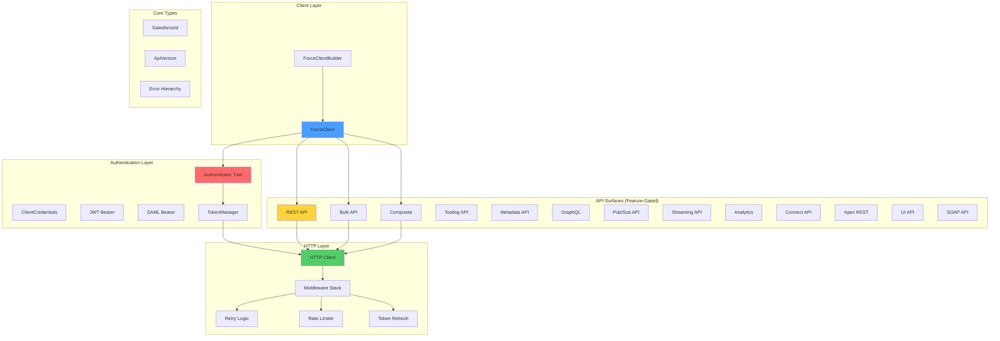
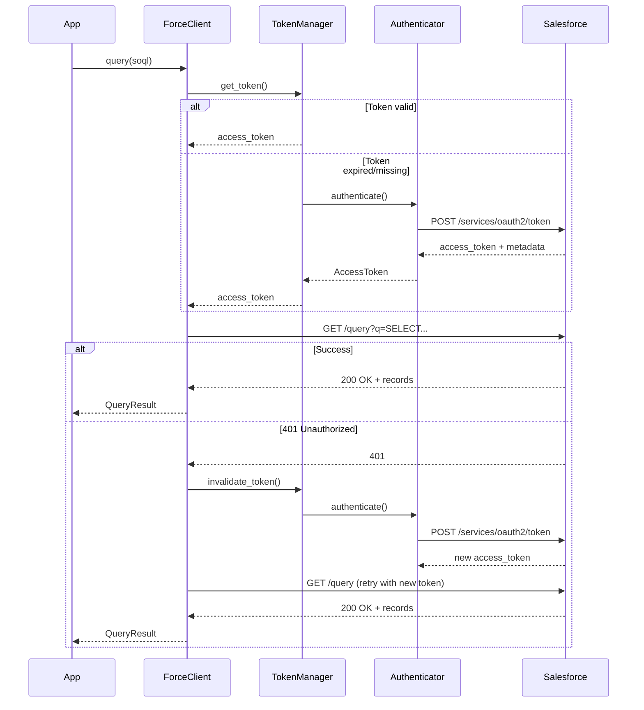

# force-rs

> Canonical Salesforce Platform API client for Rust

## Vision

`force-rs` is a production-grade, feature-gated Rust client for the Salesforce Platform API ecosystem. It provides zero-cost abstractions, compile-time safety guarantees, and TDD-driven reliability for integrating with all 15+ Salesforce API surfaces.

## Project Status

🚧 **Foundation Phase** - Building core authentication and HTTP infrastructure with strict TDD discipline.

Current milestone: Authentication layer and type system foundation

## Architecture Overview



## Core Design Principles

### 1. Feature-Gated Zero-Cost Abstractions
Only compile what you use. Each API surface is behind a feature flag:
- `rest` (default) - REST API
- `bulk` - Bulk API 2.0
- `composite` - Composite API
- `jwt` - JWT Bearer authentication flow
- `pub_sub` - gRPC Pub/Sub API
- `soap` - SOAP API
- `full` - All common features
- `all` - Everything including specialized APIs

### 2. Compile-Time Auth Safety (Phantom Type State Pattern)
The builder uses phantom types to enforce authentication at compile time:
```rust
// Won't compile - client requires authentication
let client = ForceClient::builder()
    .instance_url("https://na1.salesforce.com")
    .build(); // ERROR: No method `build` on ForceClientBuilder<Unauthenticated>

// Compiles - type state transitions to Authenticated<ClientCredentials>
let client = ForceClient::builder()
    .instance_url("https://na1.salesforce.com")
    .with_client_credentials("client_id", "client_secret")  // Transitions state
    .build()?; // OK: ForceClient<ClientCredentials>
```
See [ADR-005](docs/adr/005-compile-time-auth-safety.md) for phantom type design details.

### 3. Handler Pattern for API Organization
API operations are accessed through lightweight handler objects for clear namespacing:
```rust
// REST API operations
let accounts = client.rest().query("SELECT Id FROM Account").await?;
let contact_id = client.rest().create("Contact", &data).await?;

// Bulk API operations (feature: bulk)
let job = client.bulk().query("SELECT Id FROM Contact").await?;

// Composite API operations (feature: composite)
let result = client.composite().request(composite_req).await?;
```
See [ADR-006](docs/adr/006-handler-pattern.md) for handler pattern rationale.

### 4. TDD RED-GREEN-REFACTOR
Every feature follows strict test-driven development:
1. **RED** - Write failing test first
2. **GREEN** - Minimal implementation to pass
3. **REFACTOR** - Clean up while tests stay green

No production code without a test driving it.

### 5. Strong Typing & Semantic Safety
```rust
// Bad - primitives hide intent
fn query(id: String, version: String) -> Result<()>

// Good - newtypes enforce correctness
fn query(id: SalesforceId, version: ApiVersion) -> Result<()>
```

### 6. Error Handling Philosophy
- `thiserror` for library errors (this crate)
- Clear error hierarchy with context
- No `unwrap()` or `expect()` in production code
- Errors map to HTTP status codes and Salesforce error responses

## Module Structure

```
crates/force/src/
├── lib.rs                  # Public API surface
├── types/
│   ├── mod.rs
│   ├── salesforce_id.rs   # SalesforceId newtype (15/18 char validation)
│   └── api_version.rs     # ApiVersion newtype (v60.0 format)
├── error/
│   ├── mod.rs             # Error hierarchy
│   ├── auth_error.rs
│   ├── http_error.rs
│   └── api_error.rs
├── auth/
│   ├── mod.rs
│   ├── traits.rs          # Authenticator trait
│   ├── token.rs           # AccessToken, TokenManager
│   ├── client_credentials.rs
│   ├── jwt_bearer.rs      # Feature-gated: jwt
│   └── saml_bearer.rs     # Feature-gated: jwt
├── http/
│   ├── mod.rs
│   ├── client.rs          # HTTP layer with middleware
│   ├── retry.rs           # Exponential backoff
│   ├── rate_limit.rs      # 429 handling
│   └── middleware.rs      # 401 token refresh
├── client/
│   ├── mod.rs
│   ├── force_client.rs    # ForceClient<Auth>
│   ├── builder.rs         # ForceClientBuilder
│   └── config.rs          # ClientConfig, Environment
└── api/
    ├── rest/              # Feature: rest (default)
    ├── bulk/              # Feature: bulk
    ├── composite/         # Feature: composite
    ├── tooling/           # Feature: tooling
    └── ...                # Other API surfaces
```

## Authentication Flows



## Development Workflow

### Prerequisites
```bash
rustc 1.85+ (edition 2024)
cargo-watch
cargo-nextest (recommended)
```

### Running Tests
```bash
# Run all tests with nextest
cargo nextest run

# Run with coverage
cargo tarpaulin --workspace --out Lcov

# Run specific feature tests
cargo test --features jwt
cargo test --features bulk
```

### Code Quality
```bash
# Format (required before commit)
cargo fmt --all

# Lint with pedantic + nursery
cargo clippy --workspace --all-features -- -D warnings

# Check docs
cargo doc --no-deps --all-features
```

### Pre-Commit Checklist
- [ ] `cargo fmt` passes
- [ ] `cargo clippy` passes with no warnings
- [ ] `cargo test` passes (all features)
- [ ] Test coverage >= 85%
- [ ] New public APIs have doc comments
- [ ] ADR created for architectural decisions

## Testing Strategy

### Unit Tests
- Co-located with implementation in each module
- Use TDD RED-GREEN-REFACTOR cycle
- Mock external dependencies

### Integration Tests
```
tests/
├── auth_flows.rs          # End-to-end auth flows
├── rest_api.rs            # REST API integration
└── common/
    └── fixtures.rs        # Shared test fixtures
```

### Test Doubles
```rust
// Feature-gated mock support
#[cfg(feature = "mock")]
use force::testing::{MockForceClient, MockAuthenticator};
```

## Feature Roadmap

### Phase 1: Foundation (Current)
- [x] Workspace structure with lints
- [ ] Core types (SalesforceId, ApiVersion)
- [ ] Error hierarchy with thiserror
- [ ] Authenticator trait
- [ ] AccessToken & TokenManager
- [ ] HTTP layer with middleware
- [ ] ForceClient with compile-time auth safety

### Phase 2: Core Auth Flows
- [ ] Client credentials flow (OAuth 2.0)
- [ ] JWT bearer flow (feature: jwt)
- [ ] SAML bearer flow (feature: jwt)
- [ ] Username/password flow
- [ ] Refresh token flow

### Phase 3: REST API (Default Feature)
- [ ] Query (SOQL)
- [ ] QueryMore (pagination)
- [ ] CRUD operations (create, read, update, delete)
- [ ] Search (SOSL)
- [ ] Describe (metadata)

### Phase 4: Advanced APIs
- [ ] Bulk API 2.0 (feature: bulk)
- [ ] Composite API (feature: composite)
- [ ] Tooling API (feature: tooling)
- [ ] GraphQL API (feature: graphql)

### Phase 5: Specialized Features
- [ ] Pub/Sub API via gRPC (feature: pub_sub)
- [ ] Streaming API (feature: streaming)
- [ ] SOAP API (feature: soap)

## Configuration

### Environment-Based Config
```rust
use force::{Environment, ForceClient};

let client = ForceClient::builder()
    .environment(Environment::Production)  // or Sandbox, Custom
    .with_client_credentials("client_id", "client_secret")
    .build()?;
```

### Manual Config
```rust
use force::{ClientConfig, ForceClient};

let config = ClientConfig::builder()
    .instance_url("https://custom.my.salesforce.com")
    .api_version("v60.0")
    .timeout_seconds(30)
    .max_retries(3)
    .build()?;

let client = ForceClient::with_config(config)
    .with_jwt_bearer(jwt_config)
    .build()?;
```

## Performance Considerations

### Connection Pooling
- `reqwest` connection pool (default: 10 connections)
- Configurable via `ClientConfig`

### Rate Limiting
- Automatic 429 retry with exponential backoff
- Respects `Retry-After` headers
- Per-org rate limits (24-hour rolling window)

### Timeout Strategy
```rust
ClientConfig::builder()
    .connect_timeout(5)      // Connection timeout
    .request_timeout(30)     // Request timeout
    .build()
```

## Security

### Credential Management
```rust
use secrecy::{Secret, ExposeSecret};

// Credentials never logged or displayed
let client = ForceClient::builder()
    .with_client_credentials(
        "client_id",
        Secret::new("client_secret")  // Wrapped in secrecy
    )
    .build()?;
```

### Token Storage
- Tokens managed by `TokenManager`
- In-memory storage (default)
- Optional persistent storage (custom implementation)

### TLS/SSL
- `rustls` for TLS (no OpenSSL dependency)
- Certificate verification enforced
- Minimum TLS 1.2

## Related Projects

This crate integrates with the Mark's Rust ecosystem:
- **aletheiadb** - Bi-temporal graph database for Salesforce data models
- **vangoh** - AI-native CRM built on AletheiaDB
- **thorp** - Quant trading platform using Salesforce data

## ADRs (Architecture Decision Records)

Significant architectural decisions are documented in `docs/adr/`:
- [ADR-001](docs/adr/001-workspace-structure.md) - Workspace structure and module organization
- [ADR-002](docs/adr/002-authentication-strategy.md) - Authentication trait design and flow support
- [ADR-003](docs/adr/003-error-handling.md) - Error hierarchy with thiserror
- [ADR-004](docs/adr/004-feature-gates.md) - Feature flag strategy for API surfaces

## Contributing

This is a personal project following Mark's coding standards. Key requirements:
- Strict TDD with RED-GREEN-REFACTOR
- 85-90% test coverage minimum
- `cargo fmt` before every commit
- `cargo clippy` with pedantic/nursery
- ADRs for architectural decisions

## License

MIT OR Apache-2.0
