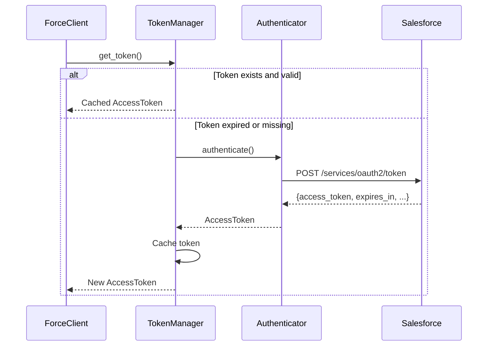

# ADR-002: Authentication Strategy and Trait Design

**Status:** Accepted
**Date:** 2026-02-07
**Deciders:** Mark M, team-lead, auth-specialist
**Context:** Authentication layer design for Salesforce OAuth 2.0 flows

## Context and Problem Statement

Salesforce supports multiple OAuth 2.0 authentication flows, each suited for different use cases:
- **Client Credentials** - Server-to-server integration
- **JWT Bearer** - Service accounts with RSA key pairs
- **SAML Bearer** - SSO scenarios
- **Username/Password** - Legacy/testing (deprecated)
- **Web Server** - Interactive user login
- **Refresh Token** - Long-lived sessions

We need an authentication architecture that:
- Supports multiple flows without code duplication
- Provides compile-time safety (clients must be authenticated)
- Handles token lifecycle (acquisition, caching, refresh)
- Is testable and mockable
- Follows async Rust best practices

How should we design the authentication layer to meet these requirements?

## Decision Drivers

- **Type safety** - Can't create unauthenticated clients
- **Extensibility** - Easy to add new auth flows
- **Token management** - Automatic refresh, caching, expiration
- **Testing** - Must support mocking in tests
- **Performance** - Minimize token requests
- **Security** - Credentials protected with `secrecy` crate
- **TDD-friendly** - Clear interfaces for test-first development

## Considered Options

### Option 1: Enum-Based Auth
```rust
pub enum AuthMethod {
    ClientCredentials { client_id: String, client_secret: String },
    JwtBearer { jwt_config: JwtConfig },
    SamlBearer { assertion: String },
}

impl ForceClient {
    pub async fn authenticate(&self, method: AuthMethod) -> Result<AccessToken> {
        match method {
            AuthMethod::ClientCredentials { .. } => { /* ... */ }
            AuthMethod::JwtBearer { .. } => { /* ... */ }
            // ...
        }
    }
}
```

**Pros:**
- Simple to implement
- Single function handles all flows

**Cons:**
- No compile-time auth checking
- Hard to extend with custom flows
- Token management logic mixed with client
- Runtime dispatch overhead

### Option 2: Trait-Based Authenticator (CHOSEN)
```rust
#[async_trait]
pub trait Authenticator: Send + Sync {
    async fn authenticate(&self) -> Result<AccessToken, AuthError>;
    fn auth_type(&self) -> &'static str;
}

pub struct ForceClient<Auth: Authenticator> {
    authenticator: Auth,
    token_manager: TokenManager<Auth>,
    // ...
}
```

**Pros:**
- Compile-time guarantee of authentication
- Easy to add custom authenticators
- Clean separation of concerns
- Zero-cost abstraction (monomorphization)
- Testable with mock implementations

**Cons:**
- More complex generic handling
- Can't easily store clients of different auth types together

### Option 3: Dynamic Dispatch with Box<dyn Authenticator>
```rust
pub struct ForceClient {
    authenticator: Box<dyn Authenticator>,
    // ...
}
```

**Pros:**
- Can store different authenticators together
- Runtime flexibility

**Cons:**
- Runtime overhead (vtable dispatch)
- Not zero-cost
- Harder to optimize
- Against Rust best practices for libraries

## Decision Outcome

**Chosen: Option 2 - Trait-Based Authenticator with Static Dispatch**

We will use a trait-based design with generic `ForceClient<Auth>` where `Auth: Authenticator`. This provides compile-time safety and zero-cost abstractions.

### Core Trait Design

```rust
use async_trait::async_trait;
use secrecy::{Secret, Zeroize};

/// Result type for authentication operations
pub type AuthResult<T> = Result<T, AuthError>;

/// Trait for Salesforce OAuth 2.0 authentication flows
#[async_trait]
pub trait Authenticator: Send + Sync + Clone {
    /// Perform authentication and return an access token
    async fn authenticate(&self) -> AuthResult<AccessToken>;

    /// Get the human-readable authentication type
    fn auth_type(&self) -> &'static str;

    /// Get the OAuth 2.0 grant type for this authenticator
    fn grant_type(&self) -> &'static str;
}
```

### Token Management



```rust
pub struct TokenManager<Auth: Authenticator> {
    authenticator: Auth,
    cached_token: Arc<RwLock<Option<CachedToken>>>,
}

impl<Auth: Authenticator> TokenManager<Auth> {
    pub async fn get_token(&self) -> AuthResult<AccessToken> {
        // Check cache first
        if let Some(token) = self.get_cached_token().await {
            if !token.is_expired() {
                return Ok(token.access_token.clone());
            }
        }

        // Authenticate and cache
        let token = self.authenticator.authenticate().await?;
        self.cache_token(token.clone()).await;
        Ok(token)
    }

    pub async fn invalidate_token(&self) {
        // Clear cache on 401 errors
        let mut cache = self.cached_token.write().await;
        *cache = None;
    }
}
```

### AccessToken Type

```rust
use chrono::{DateTime, Utc};
use secrecy::{Secret, ExposeSecret};

/// Salesforce OAuth 2.0 access token
#[derive(Clone)]
pub struct AccessToken {
    /// The access token value (protected by secrecy)
    pub(crate) access_token: Secret<String>,

    /// Token type (always "Bearer" for Salesforce)
    pub token_type: String,

    /// Instance URL for API requests
    pub instance_url: String,

    /// Unique token identifier
    pub id: String,

    /// When the token was issued
    pub issued_at: DateTime<Utc>,

    /// When the token expires (if known)
    pub expires_at: Option<DateTime<Utc>>,

    /// OAuth signature (if provided)
    pub signature: Option<String>,
}

impl AccessToken {
    /// Check if token is expired (with 60s buffer)
    pub fn is_expired(&self) -> bool {
        if let Some(expires_at) = self.expires_at {
            Utc::now() + chrono::Duration::seconds(60) >= expires_at
        } else {
            false  // No expiration known, assume valid
        }
    }

    /// Get authorization header value
    pub fn authorization_header(&self) -> String {
        format!("Bearer {}", self.access_token.expose_secret())
    }
}
```

### Concrete Implementations

#### Client Credentials Flow
```rust
#[derive(Clone)]
pub struct ClientCredentials {
    client_id: String,
    client_secret: Secret<String>,
    token_url: String,
}

#[async_trait]
impl Authenticator for ClientCredentials {
    async fn authenticate(&self) -> AuthResult<AccessToken> {
        let params = [
            ("grant_type", self.grant_type()),
            ("client_id", &self.client_id),
            ("client_secret", self.client_secret.expose_secret()),
        ];

        let response = reqwest::Client::new()
            .post(&self.token_url)
            .form(&params)
            .send()
            .await?;

        // Parse response into AccessToken
        // ...
    }

    fn auth_type(&self) -> &'static str {
        "ClientCredentials"
    }

    fn grant_type(&self) -> &'static str {
        "client_credentials"
    }
}
```

#### JWT Bearer Flow (Feature-Gated)
```rust
#[cfg(feature = "jwt")]
#[derive(Clone)]
pub struct JwtBearer {
    client_id: String,
    username: String,
    private_key: Secret<String>,
    token_url: String,
}

#[cfg(feature = "jwt")]
#[async_trait]
impl Authenticator for JwtBearer {
    async fn authenticate(&self) -> AuthResult<AccessToken> {
        // Create JWT claims
        let claims = JwtClaims {
            iss: self.client_id.clone(),
            sub: self.username.clone(),
            aud: self.token_url.clone(),
            exp: (Utc::now() + Duration::minutes(5)).timestamp(),
        };

        // Sign JWT with RSA private key
        let jwt = encode_jwt(&claims, &self.private_key)?;

        // Exchange JWT for access token
        let params = [
            ("grant_type", self.grant_type()),
            ("assertion", &jwt),
        ];

        // POST to token endpoint...
    }

    fn grant_type(&self) -> &'static str {
        "urn:ietf:params:oauth:grant-type:jwt-bearer"
    }
}
```

### ForceClient Integration

```rust
pub struct ForceClient<Auth: Authenticator> {
    token_manager: TokenManager<Auth>,
    http_client: HttpClient,
    config: ClientConfig,
}

impl<Auth: Authenticator> ForceClient<Auth> {
    async fn execute_request<T>(&self, request: Request) -> Result<T> {
        // Get token (cached or fresh)
        let token = self.token_manager.get_token().await?;

        // Make HTTP request with token
        let response = self.http_client
            .execute(request, &token)
            .await;

        match response {
            Ok(r) => Ok(r),
            Err(HttpError::Unauthorized) => {
                // Token invalid, invalidate cache and retry once
                self.token_manager.invalidate_token().await;
                let token = self.token_manager.get_token().await?;
                self.http_client.execute(request, &token).await
            }
            Err(e) => Err(e),
        }
    }
}
```

### Builder Pattern with Auth Safety

```rust
pub struct ForceClientBuilder {
    instance_url: Option<String>,
    api_version: Option<ApiVersion>,
    // No authenticator yet - builder incomplete
}

impl ForceClientBuilder {
    pub fn with_client_credentials(
        self,
        client_id: impl Into<String>,
        client_secret: impl Into<Secret<String>>,
    ) -> AuthenticatedBuilder<ClientCredentials> {
        let auth = ClientCredentials {
            client_id: client_id.into(),
            client_secret: client_secret.into(),
            token_url: self.token_url(),
        };

        AuthenticatedBuilder {
            base: self,
            authenticator: auth,
        }
    }

    #[cfg(feature = "jwt")]
    pub fn with_jwt_bearer(
        self,
        config: JwtConfig,
    ) -> AuthenticatedBuilder<JwtBearer> {
        // ...
    }
}

pub struct AuthenticatedBuilder<Auth: Authenticator> {
    base: ForceClientBuilder,
    authenticator: Auth,
}

impl<Auth: Authenticator> AuthenticatedBuilder<Auth> {
    pub fn build(self) -> Result<ForceClient<Auth>> {
        // Now we can build because we have an authenticator
        ForceClient::new(self.base.config()?, self.authenticator)
    }
}
```

## Consequences

### Positive

✅ **Compile-time safety** - Can't build `ForceClient` without authenticator
✅ **Zero-cost abstraction** - Monomorphization eliminates runtime overhead
✅ **Extensibility** - Easy to add custom authenticators
✅ **Separation of concerns** - Auth logic separate from client logic
✅ **Automatic token refresh** - TokenManager handles lifecycle
✅ **Security** - Credentials protected with `secrecy` crate
✅ **Testability** - Can mock `Authenticator` trait in tests

### Negative

⚠️ **Generic complexity** - `ForceClient<Auth>` adds type parameter
⚠️ **Can't mix auth types** - `Vec<ForceClient<_>>` with different auths needs trait objects
⚠️ **Learning curve** - Builder pattern with type state may confuse beginners

### Neutral

ℹ️ **Feature flags** - JWT/SAML flows behind features to reduce dependencies
ℹ️ **async-trait** - Required for async trait methods (adds proc macro)
ℹ️ **Token storage** - In-memory only initially, persistent storage later

## Testing Strategy

```rust
// Mock authenticator for tests
#[cfg(test)]
pub struct MockAuthenticator {
    token: AccessToken,
    should_fail: bool,
}

#[cfg(test)]
#[async_trait]
impl Authenticator for MockAuthenticator {
    async fn authenticate(&self) -> AuthResult<AccessToken> {
        if self.should_fail {
            Err(AuthError::InvalidCredentials)
        } else {
            Ok(self.token.clone())
        }
    }

    fn auth_type(&self) -> &'static str {
        "Mock"
    }
}

#[tokio::test]
async fn test_token_caching() {
    let auth = MockAuthenticator::new();
    let manager = TokenManager::new(auth);

    let token1 = manager.get_token().await.unwrap();
    let token2 = manager.get_token().await.unwrap();

    // Second call should return cached token
    assert_eq!(token1.id, token2.id);
}
```

## Validation

This decision will be validated through:
1. Implementation of `Authenticator` trait with TDD
2. `ClientCredentials` and `JwtBearer` implementations
3. `TokenManager` with caching tests
4. Integration tests with real Salesforce sandbox
5. Compile-time safety verification (invalid builders don't compile)

## Related Decisions

- [ADR-001](001-workspace-structure.md) - Module structure for auth layer
- [ADR-003](003-error-handling.md) - AuthError hierarchy
- [ADR-004](004-feature-gates.md) - JWT/SAML feature flags

## References

- [Salesforce OAuth 2.0 Flows](https://help.salesforce.com/s/articleView?id=sf.remoteaccess_oauth_flows.htm)
- [OAuth 2.0 Client Credentials](https://datatracker.ietf.org/doc/html/rfc6749#section-4.4)
- [OAuth 2.0 JWT Bearer](https://datatracker.ietf.org/doc/html/rfc7523)
- [secrecy crate](https://docs.rs/secrecy/)
- [async-trait crate](https://docs.rs/async-trait/)
