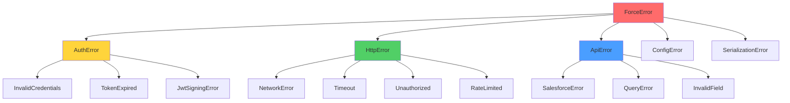

# ADR-003: Error Handling Strategy with thiserror

**Status:** Accepted
**Date:** 2026-02-07
**Deciders:** Mark M, team-lead, error-specialist
**Context:** Error hierarchy design for force-rs library

## Context and Problem Statement

Rust libraries require well-designed error types that:
- Provide clear context about what went wrong
- Allow callers to handle specific error cases
- Compose well with other error types
- Support error chaining (preserving underlying causes)
- Are ergonomic to work with

force-rs will encounter errors from multiple sources:
- **Authentication** - Invalid credentials, expired tokens, OAuth failures
- **HTTP** - Network failures, timeouts, 4xx/5xx responses
- **API** - Salesforce-specific errors (field validation, SOQL syntax, limits)
- **Serialization** - JSON parsing, type conversion
- **Configuration** - Invalid URLs, malformed API versions

How should we structure our error types to handle these diverse failure modes?

## Decision Drivers

- **Library context** - Use `thiserror` (not `anyhow`)
- **Caller control** - Users can match on specific errors
- **Error context** - Preserve underlying causes
- **Type safety** - Errors at appropriate granularity
- **Debuggability** - Clear error messages with context
- **Composability** - Works with `?` operator
- **No unwrap/expect** - Explicit error handling required
- **Standards compliance** - Follows Mark's patterns

## Considered Options

### Option 1: Single Error Enum
```rust
#[derive(Debug, thiserror::Error)]
pub enum ForceError {
    #[error("Authentication failed: {0}")]
    Auth(String),
    #[error("HTTP error: {0}")]
    Http(String),
    #[error("API error: {0}")]
    Api(String),
}
```

**Pros:**
- Simple to implement
- Single error type for all APIs

**Cons:**
- Loss of type information (all strings)
- Hard to match on specific cases
- Can't distinguish sub-categories
- Poor debuggability

### Option 2: Hierarchical Error Types (CHOSEN)
```rust
#[derive(Debug, thiserror::Error)]
pub enum ForceError {
    #[error(transparent)]
    Auth(#[from] AuthError),
    #[error(transparent)]
    Http(#[from] HttpError),
    #[error(transparent)]
    Api(#[from] ApiError),
}

#[derive(Debug, thiserror::Error)]
pub enum AuthError {
    #[error("Invalid credentials")]
    InvalidCredentials,
    #[error("Token expired")]
    TokenExpired,
    // ...
}
```

**Pros:**
- Type-safe error handling
- Caller can match specific errors
- Clear error hierarchy
- Good debuggability
- Each layer owns its errors

**Cons:**
- More boilerplate
- Nested matching required

### Option 3: anyhow for Everything
```rust
pub type Result<T> = anyhow::Result<T>;
```

**Pros:**
- Minimal code
- Easy error chaining

**Cons:**
- **WRONG for libraries** - anyhow is for applications
- Loss of type information
- Can't match on errors
- Violates Mark's standards

## Decision Outcome

**Chosen: Option 2 - Hierarchical Error Types with thiserror**

We will create a layered error hierarchy where each module defines its own error type, and they compose into a top-level `ForceError`.

### Error Hierarchy



### Top-Level ForceError

```rust
use thiserror::Error;

/// Top-level error type for force-rs operations
#[derive(Debug, Error)]
pub enum ForceError {
    /// Authentication-related errors
    #[error(transparent)]
    Auth(#[from] AuthError),

    /// HTTP transport errors
    #[error(transparent)]
    Http(#[from] HttpError),

    /// Salesforce API errors
    #[error(transparent)]
    Api(#[from] ApiError),

    /// Configuration errors
    #[error(transparent)]
    Config(#[from] ConfigError),

    /// Serialization/deserialization errors
    #[error(transparent)]
    Serialization(#[from] SerializationError),
}

/// Result type for force-rs operations
pub type Result<T, E = ForceError> = std::result::Result<T, E>;
```

### AuthError (auth/error.rs)

```rust
use thiserror::Error;

/// Authentication-related errors
#[derive(Debug, Error)]
pub enum AuthError {
    /// Invalid client credentials
    #[error("Invalid credentials: client authentication failed")]
    InvalidCredentials,

    /// Access token has expired
    #[error("Access token expired at {expired_at}")]
    TokenExpired {
        expired_at: chrono::DateTime<chrono::Utc>,
    },

    /// JWT signing failed
    #[cfg(feature = "jwt")]
    #[error("JWT signing failed: {reason}")]
    JwtSigningError {
        reason: String,
        #[source]
        source: jsonwebtoken::errors::Error,
    },

    /// OAuth token endpoint returned an error
    #[error("OAuth error: {error_code} - {error_description}")]
    OAuthError {
        error_code: String,
        error_description: String,
    },

    /// Network error during authentication
    #[error("Authentication network error")]
    NetworkError(#[from] reqwest::Error),

    /// Unexpected authentication response
    #[error("Unexpected auth response: {message}")]
    UnexpectedResponse { message: String },
}

/// Result type for authentication operations
pub type AuthResult<T> = Result<T, AuthError>;
```

### HttpError (http/error.rs)

```rust
use thiserror::Error;
use reqwest::StatusCode;

/// HTTP transport errors
#[derive(Debug, Error)]
pub enum HttpError {
    /// Network-level error
    #[error("Network error: {0}")]
    Network(#[from] reqwest::Error),

    /// Request timeout
    #[error("Request timeout after {seconds}s")]
    Timeout { seconds: u64 },

    /// HTTP 401 Unauthorized
    #[error("Unauthorized: authentication failed or token expired")]
    Unauthorized,

    /// HTTP 403 Forbidden
    #[error("Forbidden: insufficient permissions")]
    Forbidden,

    /// HTTP 404 Not Found
    #[error("Not found: {resource}")]
    NotFound { resource: String },

    /// HTTP 429 Too Many Requests
    #[error("Rate limited: retry after {retry_after_seconds}s")]
    RateLimited {
        retry_after_seconds: Option<u64>,
    },

    /// HTTP 5xx Server Error
    #[error("Server error: {status_code}")]
    ServerError {
        status_code: StatusCode,
        body: String,
    },

    /// Unexpected HTTP status
    #[error("Unexpected status {status_code}: {body}")]
    UnexpectedStatus {
        status_code: StatusCode,
        body: String,
    },

    /// Max retries exceeded
    #[error("Max retries ({max_retries}) exceeded")]
    MaxRetriesExceeded { max_retries: u32 },
}

/// Result type for HTTP operations
pub type HttpResult<T> = Result<T, HttpError>;
```

### ApiError (api/error.rs)

```rust
use thiserror::Error;
use serde::{Deserialize, Serialize};

/// Salesforce API errors
#[derive(Debug, Error)]
pub enum ApiError {
    /// Salesforce API returned an error response
    #[error("Salesforce error [{error_code}]: {message}")]
    SalesforceError {
        error_code: String,
        message: String,
        fields: Vec<String>,
    },

    /// SOQL query syntax error
    #[error("SOQL syntax error: {message} at position {position}")]
    QuerySyntaxError {
        message: String,
        position: Option<usize>,
    },

    /// Field validation error
    #[error("Invalid field '{field}': {message}")]
    InvalidField { field: String, message: String },

    /// Record not found
    #[error("Record not found: {record_id}")]
    RecordNotFound { record_id: String },

    /// API limit exceeded
    #[error("API limit exceeded: {limit_type}")]
    LimitExceeded { limit_type: String },

    /// Malformed response from Salesforce
    #[error("Malformed API response: {reason}")]
    MalformedResponse { reason: String },

    /// Deserialization error
    #[error("Failed to deserialize response")]
    DeserializationError(#[from] serde_json::Error),
}

/// Salesforce error response structure
#[derive(Debug, Clone, Serialize, Deserialize)]
pub struct SalesforceErrorResponse {
    pub message: String,
    #[serde(rename = "errorCode")]
    pub error_code: String,
    #[serde(default)]
    pub fields: Vec<String>,
}

/// Result type for API operations
pub type ApiResult<T> = Result<T, ApiError>;
```

### ConfigError (client/error.rs)

```rust
use thiserror::Error;

/// Configuration errors
#[derive(Debug, Error)]
pub enum ConfigError {
    /// Invalid instance URL
    #[error("Invalid instance URL: {url}")]
    InvalidInstanceUrl { url: String },

    /// Invalid API version format
    #[error("Invalid API version: {version} (expected format: v60.0)")]
    InvalidApiVersion { version: String },

    /// Invalid Salesforce ID format
    #[error("Invalid Salesforce ID: {id} (expected 15 or 18 characters)")]
    InvalidSalesforceId { id: String },

    /// Missing required configuration
    #[error("Missing required config: {field}")]
    MissingConfig { field: String },

    /// Invalid configuration value
    #[error("Invalid config for {field}: {reason}")]
    InvalidConfig { field: String, reason: String },
}

/// Result type for configuration operations
pub type ConfigResult<T> = Result<T, ConfigError>;
```

### SerializationError

```rust
use thiserror::Error;

/// Serialization/deserialization errors
#[derive(Debug, Error)]
pub enum SerializationError {
    /// JSON error
    #[error("JSON error")]
    Json(#[from] serde_json::Error),

    /// CSV error (bulk API)
    #[cfg(feature = "bulk")]
    #[error("CSV error")]
    Csv(#[from] csv::Error),

    /// XML error (SOAP API)
    #[cfg(feature = "soap")]
    #[error("XML error")]
    Xml(#[from] quick_xml::Error),

    /// Type conversion error
    #[error("Type conversion error: {message}")]
    TypeConversion { message: String },
}
```

## Usage Patterns

### Matching Specific Errors

```rust
use force::{ForceClient, ForceError, AuthError, HttpError};

match client.query("SELECT Id FROM Account").await {
    Ok(records) => println!("Found {} records", records.len()),
    Err(ForceError::Auth(AuthError::TokenExpired { .. })) => {
        println!("Token expired, re-authenticating...");
        // Handle re-auth
    }
    Err(ForceError::Http(HttpError::RateLimited { retry_after_seconds })) => {
        println!("Rate limited, retry after {}s", retry_after_seconds.unwrap_or(60));
        // Handle rate limit
    }
    Err(ForceError::Api(api_err)) => {
        eprintln!("API error: {}", api_err);
    }
    Err(e) => {
        eprintln!("Unexpected error: {}", e);
    }
}
```

### Error Context with `?` Operator

```rust
pub async fn create_account(client: &ForceClient<C>, name: &str) -> Result<String> {
    let account = serde_json::json!({
        "Name": name,
    });

    // Errors automatically converted via From trait
    let response = client
        .create("Account", &account)
        .await?;  // AuthError, HttpError, ApiError all work

    Ok(response.id)
}
```

### Custom Error Context

```rust
impl From<url::ParseError> for ConfigError {
    fn from(err: url::ParseError) -> Self {
        ConfigError::InvalidInstanceUrl {
            url: err.to_string(),
        }
    }
}
```

## Consequences

### Positive

✅ **Type safety** - Callers can match on specific error types
✅ **Error context** - Rich information about what went wrong
✅ **Composability** - `?` operator works seamlessly
✅ **Debuggability** - Clear error messages with structured data
✅ **No unwrap** - Compile-time enforcement via lints
✅ **Standard pattern** - Follows Rust error handling best practices
✅ **thiserror benefits** - Automatic `Display`, `Error`, `From` impls

### Negative

⚠️ **Boilerplate** - Each error type needs definition
⚠️ **Nested matching** - `ForceError::Auth(AuthError::TokenExpired)` verbose
⚠️ **Maintenance** - Must keep error types aligned with failure modes

### Neutral

ℹ️ **Feature gates** - Some errors only exist with features enabled
ℹ️ **Error evolution** - Easy to add new variants without breaking changes
ℹ️ **Source preservation** - `#[source]` and `#[from]` maintain error chains

## Testing Strategy

```rust
#[cfg(test)]
mod tests {
    use super::*;

    #[test]
    fn test_auth_error_display() {
        let err = AuthError::InvalidCredentials;
        assert_eq!(
            err.to_string(),
            "Invalid credentials: client authentication failed"
        );
    }

    #[test]
    fn test_error_conversion() {
        let http_err = HttpError::Unauthorized;
        let force_err: ForceError = http_err.into();

        match force_err {
            ForceError::Http(HttpError::Unauthorized) => {}
            _ => panic!("Wrong error type"),
        }
    }

    #[test]
    fn test_error_source_chain() {
        let reqwest_err = /* ... */;
        let http_err = HttpError::Network(reqwest_err);
        let force_err = ForceError::Http(http_err);

        // Verify source chain preserved
        assert!(force_err.source().is_some());
    }
}
```

## Validation

This decision will be validated through:
1. Implementation with TDD (error cases first)
2. Ergonomics of `?` operator in real code
3. Clarity of error messages in integration tests
4. Ability to handle specific error cases in examples
5. No `unwrap()` or `expect()` in production code (enforced by clippy)

## Related Decisions

- [ADR-001](001-workspace-structure.md) - Error module location
- [ADR-002](002-authentication-strategy.md) - AuthError design
- ADR-005 (future) - HTTP middleware error handling

## References

- [thiserror crate](https://docs.rs/thiserror/)
- [Rust Error Handling](https://doc.rust-lang.org/book/ch09-00-error-handling.html)
- [Mark's Standards](C:\Users\markm\.claude\CLAUDE.md) - "thiserror for library errors"
- [Error Handling Survey](https://blog.burntsushi.net/rust-error-handling/)
