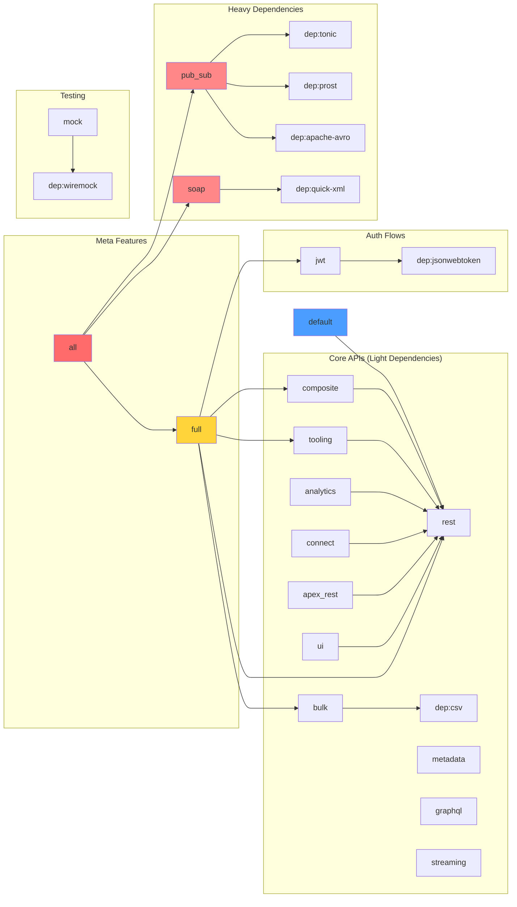

# ADR-004: Feature Flag Strategy for API Surfaces

**Status:** Accepted
**Date:** 2026-02-07
**Deciders:** Mark M, team-lead
**Context:** Zero-cost abstraction via compile-time feature gates

## Context and Problem Statement

The Salesforce Platform offers 15+ distinct API surfaces, each with unique dependencies:

| API Surface | Dependencies | Use Case |
|-------------|--------------|----------|
| REST API | None (reqwest, serde) | Standard CRUD, queries |
| Bulk API 2.0 | csv | Large data operations |
| Composite API | None | Batch requests |
| Tooling API | None | Metadata and debugging |
| Metadata API | None | Schema management |
| GraphQL API | None | Graph queries |
| Pub/Sub API | tonic, prost, apache-avro | Real-time gRPC streams |
| Streaming API | None | Long-polling events |
| Analytics API | None | Reports and dashboards |
| Connect API | None | Chatter and communities |
| Apex REST | None | Custom endpoints |
| UI API | None | Pre-built UI components |
| SOAP API | quick-xml | Legacy integrations |
| JWT Auth | jsonwebtoken | Service account auth |
| SAML Auth | jsonwebtoken | SSO auth |

**Problem:** Most applications only use 2-3 API surfaces. Forcing all dependencies increases compile time, binary size, and attack surface.

**Goal:** Compile only what's needed. A REST-only app shouldn't pull in gRPC, XML parsers, or JWT libraries.

## Decision Drivers

- **Zero-cost abstractions** - Pay only for what you use
- **Compile time** - Minimize dependencies for common use cases
- **Binary size** - Smaller binaries for embedded/Lambda deployments
- **Security** - Reduce attack surface (fewer dependencies = fewer CVEs)
- **Ergonomics** - Simple defaults, easy to enable features
- **Discoverability** - Clear documentation of features
- **Maintenance** - Feature combinations must be tested

## Considered Options

### Option 1: Monolithic Crate (No Features)
```toml
[dependencies]
reqwest = "0.12"
tonic = "0.12"
quick-xml = "0.37"
csv = "1.3"
jsonwebtoken = "9.3"
# Everything compiled always
```

**Pros:**
- Simple - one configuration
- No conditional compilation complexity

**Cons:**
- **Bloated binaries** - 30+ dependencies even for simple REST
- **Slow compile** - gRPC codegen even if unused
- **Large attack surface** - XML parser even if never used
- Violates zero-cost abstraction principle

### Option 2: Fine-Grained Features (CHOSEN)
```toml
[features]
default = ["rest"]
rest = []
bulk = ["dep:csv"]
jwt = ["dep:jsonwebtoken"]
pub_sub = ["dep:tonic", "dep:prost", "dep:apache-avro"]
soap = ["dep:quick-xml"]
full = ["rest", "bulk", "composite", "tooling", "jwt"]
all = ["full", "pub_sub", "soap"]
```

**Pros:**
- Minimal default (REST only)
- Users opt-in to heavy dependencies
- Clear cost for each feature
- Easy to understand

**Cons:**
- More complex Cargo.toml
- Must test feature combinations
- Documentation must explain features

### Option 3: Separate Crates per API
```
force-rest/
force-bulk/
force-pubsub/
force-soap/
```

**Pros:**
- Maximum separation
- Independent versioning

**Cons:**
- Over-engineering for single library
- Code duplication (auth, HTTP, errors)
- Complex to maintain
- Poor discoverability

## Decision Outcome

**Chosen: Option 2 - Fine-Grained Feature Flags**

We will use Cargo features to gate API surfaces and heavy dependencies. The `rest` feature is default, all others are opt-in.

### Feature Structure



### Feature Definitions

```toml
[features]
# Default feature set (minimal dependencies)
default = ["rest"]

# === Core API Surfaces ===
rest = []
bulk = ["dep:csv"]
composite = ["rest"]
tooling = ["rest"]
metadata = []
graphql = []
pub_sub = ["dep:tonic", "dep:prost", "dep:apache-avro"]
streaming = []
analytics = ["rest"]
connect = ["rest"]
apex_rest = ["rest"]
ui = ["rest"]
soap = ["dep:quick-xml"]

# === Authentication Flows ===
jwt = ["dep:jsonwebtoken"]

# === Testing Utilities ===
mock = ["dep:wiremock"]

# === Meta Features ===
# Common production use: REST + Bulk + JWT
full = [
    "rest",
    "bulk",
    "composite",
    "tooling",
    "metadata",
    "graphql",
    "analytics",
    "connect",
    "apex_rest",
    "ui",
    "jwt"
]

# Everything including heavy deps
all = ["full", "pub_sub", "streaming", "soap"]
```

### Conditional Compilation

#### Module Level
```rust
// crates/force/src/api/bulk/mod.rs
#![cfg(feature = "bulk")]

pub mod job;
pub mod ingest;
pub mod query;

use csv::{Reader, Writer};  // Only compiled with "bulk" feature
```

#### Type Level
```rust
// crates/force/src/auth/jwt_bearer.rs
#[cfg(feature = "jwt")]
use jsonwebtoken::{encode, EncodingKey, Header};

#[cfg(feature = "jwt")]
pub struct JwtBearer {
    client_id: String,
    username: String,
    private_key: Secret<String>,
    token_url: String,
}

#[cfg(feature = "jwt")]
impl Authenticator for JwtBearer {
    // Implementation
}
```

#### API Surface Gating
```rust
// crates/force/src/client/force_client.rs
impl<Auth: Authenticator> ForceClient<Auth> {
    // Always available (core)
    pub async fn query(&self, soql: &str) -> Result<QueryResult> {
        #[cfg(feature = "rest")]
        {
            self.rest_client.query(soql).await
        }
        #[cfg(not(feature = "rest"))]
        {
            compile_error!("REST feature required for query()")
        }
    }

    // Only with "bulk" feature
    #[cfg(feature = "bulk")]
    pub async fn bulk_query(&self, soql: &str) -> Result<BulkJobId> {
        self.bulk_client.query(soql).await
    }

    // Only with "pub_sub" feature
    #[cfg(feature = "pub_sub")]
    pub async fn subscribe(
        &self,
        topic: &str,
    ) -> Result<PubSubStream> {
        self.pubsub_client.subscribe(topic).await
    }
}
```

### Dependency Mapping

| Feature | Added Dependencies | Size Impact | Compile Time Impact |
|---------|-------------------|-------------|---------------------|
| `rest` (default) | None | Baseline | Baseline |
| `bulk` | csv | +50 KB | +2s |
| `jwt` | jsonwebtoken | +200 KB | +5s |
| `pub_sub` | tonic, prost, apache-avro | +3 MB | +45s |
| `soap` | quick-xml | +150 KB | +4s |
| `full` | csv, jsonwebtoken | +250 KB | +7s |
| `all` | All of the above | +3.5 MB | +55s |

### Usage Examples

#### Minimal REST Client (Default)
```toml
[dependencies]
force = "0.1"
```

```rust
use force::ForceClient;

let client = ForceClient::builder()
    .with_client_credentials("id", "secret")
    .build()?;

// REST API works
let accounts = client.query("SELECT Id FROM Account").await?;
```

#### REST + Bulk API
```toml
[dependencies]
force = { version = "0.1", features = ["bulk"] }
```

```rust
// REST and Bulk both available
let job_id = client.bulk_query("SELECT Id FROM Contact").await?;
```

#### JWT Authentication
```toml
[dependencies]
force = { version = "0.1", features = ["jwt"] }
```

```rust
let client = ForceClient::builder()
    .with_jwt_bearer(jwt_config)  // Only with "jwt" feature
    .build()?;
```

#### Full-Featured Client
```toml
[dependencies]
force = { version = "0.1", features = ["full"] }
```

```rust
// All common APIs available (REST, Bulk, Composite, JWT, etc.)
```

#### Everything (Including Heavy Deps)
```toml
[dependencies]
force = { version = "0.1", features = ["all"] }
```

```rust
// Every API surface available
```

## Documentation Strategy

### Feature Matrix in README
```markdown
| Feature | Description | Dependencies | Default |
|---------|-------------|--------------|---------|
| `rest` | REST API | None | ✅ Yes |
| `bulk` | Bulk API 2.0 | csv | No |
| `jwt` | JWT Bearer auth | jsonwebtoken | No |
| `pub_sub` | Pub/Sub gRPC | tonic, prost | No |
```

### Cargo.toml Comments
```toml
# Common feature combinations:
# - REST only (default): force = "0.1"
# - REST + Bulk: force = { version = "0.1", features = ["bulk"] }
# - REST + JWT auth: force = { version = "0.1", features = ["jwt"] }
# - All common APIs: force = { version = "0.1", features = ["full"] }
# - Everything: force = { version = "0.1", features = ["all"] }
```

### API Docs with #[doc]
```rust
#[cfg(feature = "bulk")]
#[cfg_attr(docsrs, doc(cfg(feature = "bulk")))]
pub async fn bulk_query(&self, soql: &str) -> Result<BulkJobId> {
    // docs.rs shows "This API requires feature: bulk"
}
```

## Testing Feature Combinations

### CI Matrix
```yaml
# .github/workflows/ci.yml
strategy:
  matrix:
    features:
      - default          # REST only
      - bulk
      - jwt
      - full
      - all
      - "rest,bulk"      # Common combo
      - "rest,jwt"       # Common combo
      - "bulk,jwt"       # Common combo

steps:
  - run: cargo test --no-default-features --features ${{ matrix.features }}
```

### Feature-Specific Tests
```rust
#[cfg(feature = "bulk")]
#[tokio::test]
async fn test_bulk_query() {
    // Only runs when "bulk" feature enabled
}

#[cfg(all(feature = "rest", feature = "bulk"))]
#[tokio::test]
async fn test_rest_to_bulk_workflow() {
    // Only runs when both features enabled
}
```

## Consequences

### Positive

✅ **Zero-cost abstraction** - Only compile what's needed
✅ **Fast default** - REST-only builds are quick (~30s cold)
✅ **Small binaries** - Default binary ~2MB vs ~5MB with "all"
✅ **Security** - Reduced attack surface (fewer dependencies)
✅ **Clear costs** - Feature documentation shows size/compile impact
✅ **Flexible** - Easy to enable more features as needed
✅ **Standard pattern** - Matches tokio, serde, reqwest

### Negative

⚠️ **CI complexity** - Must test feature combinations
⚠️ **Documentation** - Must explain features clearly
⚠️ **Conditional compilation** - `#[cfg(feature = "...")]` everywhere
⚠️ **Feature creep** - Temptation to add too many features

### Neutral

ℹ️ **Breaking changes** - Removing features is breaking change
ℹ️ **Feature dependencies** - Some features imply others (composite -> rest)
ℹ️ **docs.rs** - Builds with all features for complete docs

## Validation

This decision will be validated through:
1. Compile time benchmarks (default vs full vs all)
2. Binary size measurements
3. CI matrix tests covering key combinations
4. User feedback on feature discoverability
5. Dependency audit reports

## Related Decisions

- [ADR-001](001-workspace-structure.md) - Module structure supports feature gating
- [ADR-002](002-authentication-strategy.md) - JWT auth is feature-gated
- [ADR-003](003-error-handling.md) - Some errors only exist with features

## References

- [Cargo Features](https://doc.rust-lang.org/cargo/reference/features.html)
- [Optional Dependencies](https://doc.rust-lang.org/cargo/reference/features.html#optional-dependencies)
- [tokio features](https://github.com/tokio-rs/tokio/blob/master/tokio/Cargo.toml) - Good example
- [reqwest features](https://github.com/seanmonstar/reqwest/blob/master/Cargo.toml) - Another example
- [cfg-if crate](https://docs.rs/cfg-if/) - For complex feature logic
