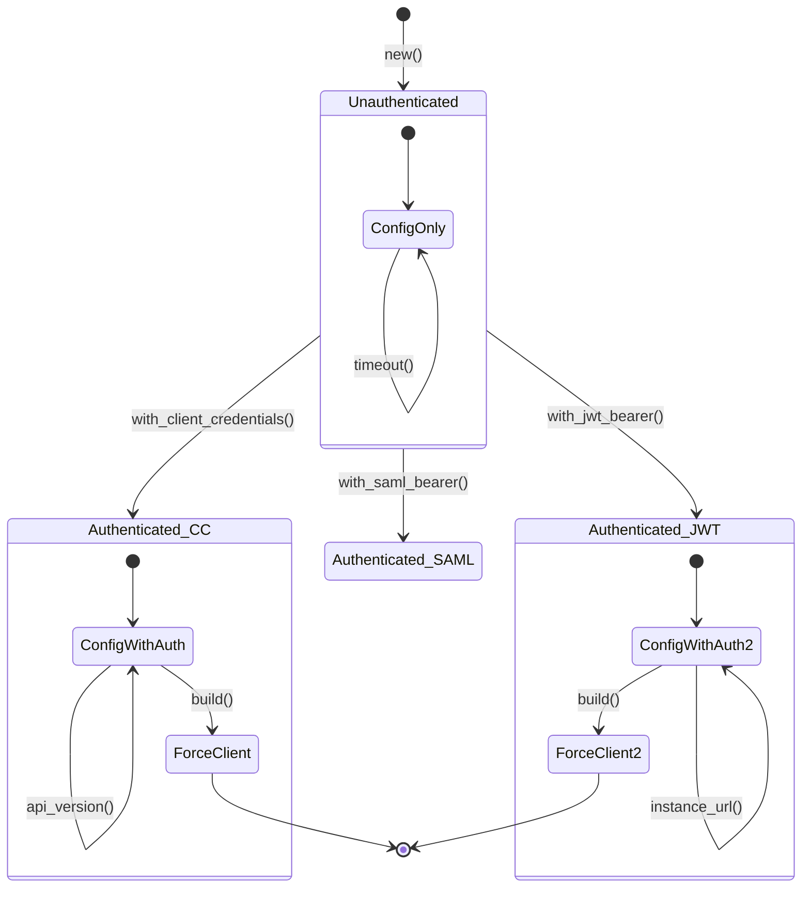

# ADR-005: Compile-Time Auth Safety with Phantom Types

**Status:** Accepted
**Date:** 2026-02-07
**Deciders:** Mark M, team-lead, auth-specialist
**Context:** Builder pattern design for ForceClient authentication

## Context and Problem Statement

We want to prevent runtime errors where a `ForceClient` is created without proper authentication. Traditional builder patterns allow this:

```rust
// Bad: Compiles but panics at runtime
let client = ForceClient::builder()
    .instance_url("https://na1.salesforce.com")
    .build()?;  // PANIC: No authenticator provided!
```

This leads to:
- Runtime panics or Result errors that could be caught at compile time
- Poor developer experience (error discovered late)
- Unnecessary test coverage for invalid states
- Documentation burden explaining required vs optional fields

How can we use Rust's type system to make authentication **required at compile time**?

## Decision Drivers

- **Compile-time safety** - Invalid clients won't compile
- **Clear error messages** - Compiler tells you what's missing
- **Zero runtime cost** - Type state pattern has no overhead
- **Ergonomic API** - Builder pattern remains intuitive
- **Extensible** - Easy to add new auth flows
- **Self-documenting** - Types encode requirements

## Considered Options

### Option 1: Runtime Validation
```rust
pub struct ForceClientBuilder {
    instance_url: Option<String>,
    authenticator: Option<Box<dyn Authenticator>>,
}

impl ForceClientBuilder {
    pub fn build(self) -> Result<ForceClient> {
        let auth = self.authenticator
            .ok_or(Error::MissingAuthenticator)?;
        // ...
    }
}
```

**Pros:**
- Simple to implement
- Flexible builder

**Cons:**
- Runtime error (not compile time)
- Must handle error case in every build() call
- Poor discoverability of requirements

### Option 2: Separate Builders (No Phantom Types)
```rust
pub struct UnauthenticatedBuilder { /* ... */ }
pub struct AuthenticatedBuilder<Auth> {
    base: UnauthenticatedBuilder,
    authenticator: Auth,
}

impl UnauthenticatedBuilder {
    pub fn with_client_credentials(self, ...) -> AuthenticatedBuilder<ClientCredentials> {
        // ...
    }
}

impl<Auth: Authenticator> AuthenticatedBuilder<Auth> {
    pub fn build(self) -> ForceClient<Auth> {
        // Only authenticated builder can build
    }
}
```

**Pros:**
- Compile-time safety
- No phantom types needed
- Clear type progression

**Cons:**
- Two separate builder types
- Can't add config after authentication
- Less flexible API

### Option 3: Phantom Type State Pattern (CHOSEN)
```rust
use std::marker::PhantomData;

// Type-level markers
pub struct Unauthenticated;
pub struct Authenticated<Auth: Authenticator>(PhantomData<Auth>);

pub struct ForceClientBuilder<State = Unauthenticated> {
    instance_url: Option<String>,
    api_version: Option<ApiVersion>,
    authenticator: Option<Auth>,  // Only Some in Authenticated state
    _state: PhantomData<State>,
}

// Only unauthenticated builder can authenticate
impl ForceClientBuilder<Unauthenticated> {
    pub fn new() -> Self {
        Self {
            instance_url: None,
            api_version: None,
            authenticator: None,
            _state: PhantomData,
        }
    }

    pub fn with_client_credentials(
        self,
        client_id: impl Into<String>,
        client_secret: impl Into<Secret<String>>,
    ) -> ForceClientBuilder<Authenticated<ClientCredentials>> {
        let auth = ClientCredentials::new(
            client_id.into(),
            client_secret.into(),
        );

        ForceClientBuilder {
            instance_url: self.instance_url,
            api_version: self.api_version,
            authenticator: Some(auth),
            _state: PhantomData,
        }
    }

    #[cfg(feature = "jwt")]
    pub fn with_jwt_bearer(
        self,
        config: JwtConfig,
    ) -> ForceClientBuilder<Authenticated<JwtBearer>> {
        // Similar transformation
    }
}

// Configuration methods available in both states
impl<State> ForceClientBuilder<State> {
    pub fn instance_url(mut self, url: impl Into<String>) -> Self {
        self.instance_url = Some(url.into());
        self
    }

    pub fn api_version(mut self, version: ApiVersion) -> Self {
        self.api_version = Some(version);
        self
    }
}

// Only authenticated builder can build
impl<Auth: Authenticator> ForceClientBuilder<Authenticated<Auth>> {
    pub fn build(self) -> Result<ForceClient<Auth>> {
        // We KNOW authenticator is Some because of type state
        let auth = self.authenticator.unwrap();  // Safe unwrap!

        ForceClient::new(
            self.instance_url.ok_or(Error::MissingInstanceUrl)?,
            self.api_version.unwrap_or_default(),
            auth,
        )
    }
}
```

**Pros:**
- ✅ Compile-time safety - can't build() without auth
- ✅ Single builder type (less code)
- ✅ Config methods available before and after auth
- ✅ Zero runtime cost (PhantomData is zero-sized)
- ✅ Clear error messages from compiler

**Cons:**
- Slightly complex for beginners
- Requires understanding of phantom types
- More generic complexity

## Decision Outcome

**Chosen: Option 3 - Phantom Type State Pattern**

We will use phantom types to encode authentication state in the builder's type. The compiler enforces that `build()` is only callable on authenticated builders.

### Type State Diagram



### Implementation Details

#### Phantom Type Markers
```rust
/// Marker type: Builder has no authenticator yet
pub struct Unauthenticated;

/// Marker type: Builder has authenticator of type Auth
pub struct Authenticated<Auth>(PhantomData<Auth>);
```

#### Builder Structure
```rust
pub struct ForceClientBuilder<State = Unauthenticated> {
    // Common configuration (always present)
    instance_url: Option<String>,
    api_version: Option<ApiVersion>,
    timeout: Option<Duration>,
    max_retries: Option<u32>,

    // Authenticator (only Some in Authenticated<Auth> state)
    authenticator: Option<Box<dyn Authenticator>>,  // Or concrete type

    // Zero-sized marker (compiled away)
    _state: PhantomData<State>,
}
```

#### State Transitions
```rust
impl ForceClientBuilder<Unauthenticated> {
    // Constructor creates unauthenticated builder
    pub fn new() -> Self { /* ... */ }

    // Authentication methods transition to Authenticated<Auth>
    pub fn with_client_credentials(
        self,
        client_id: impl Into<String>,
        client_secret: impl Into<Secret<String>>,
    ) -> ForceClientBuilder<Authenticated<ClientCredentials>> {
        // Type state changes: Unauthenticated -> Authenticated<ClientCredentials>
        ForceClientBuilder {
            instance_url: self.instance_url,
            api_version: self.api_version,
            timeout: self.timeout,
            max_retries: self.max_retries,
            authenticator: Some(Box::new(ClientCredentials::new(
                client_id.into(),
                client_secret.into(),
            ))),
            _state: PhantomData,
        }
    }
}
```

#### Type-Safe Build
```rust
// build() ONLY available on Authenticated<Auth>
impl<Auth: Authenticator> ForceClientBuilder<Authenticated<Auth>> {
    pub fn build(self) -> Result<ForceClient<Auth>> {
        // Type system guarantees authenticator is Some
        let auth = self.authenticator.unwrap();  // Safe!

        ForceClient::new(
            self.instance_url.ok_or(Error::MissingInstanceUrl)?,
            self.api_version.unwrap_or_default(),
            auth,
        )
    }
}
```

### Usage Examples

#### ✅ Valid: Authentication Provided
```rust
let client = ForceClient::builder()
    .instance_url("https://na1.salesforce.com")
    .api_version(ApiVersion::v60())
    .with_client_credentials("client_id", "client_secret")
    .timeout(Duration::from_secs(30))  // Config after auth still works
    .build()?;  // ✅ Compiles: Authenticated<ClientCredentials>
```

#### ❌ Invalid: No Authentication (Won't Compile)
```rust
let client = ForceClient::builder()
    .instance_url("https://na1.salesforce.com")
    .build();  // ❌ Compile error: no method `build()` found for ForceClientBuilder<Unauthenticated>
```

#### ✅ Valid: Different Auth Flow
```rust
#[cfg(feature = "jwt")]
let client = ForceClient::builder()
    .with_jwt_bearer(jwt_config)  // Authenticated<JwtBearer>
    .instance_url("https://na1.salesforce.com")
    .build()?;  // ✅ Compiles
```

### Compiler Error Messages

When authentication is missing:
```
error[E0599]: no method named `build` found for struct `ForceClientBuilder<Unauthenticated>`
  --> src/main.rs:10:6
   |
10 |     .build()?;
   |      ^^^^^ method not found in `ForceClientBuilder<Unauthenticated>`
   |
   = help: items from traits can only be used if the trait is in scope
   = note: the following trait defines an item `build`, perhaps you need to implement it:
           candidate #1: `ForceClientBuilder<Authenticated<Auth>>::build`
```

Clear message: You need to call an authentication method first!

## Consequences

### Positive

✅ **Compile-time safety** - Invalid clients rejected by compiler
✅ **Zero runtime cost** - PhantomData is zero-sized, optimized away
✅ **Self-documenting** - Type signature shows requirements
✅ **Great error messages** - Compiler tells you exactly what's missing
✅ **Flexible API** - Config methods work before and after auth
✅ **No test bloat** - Don't need to test invalid states
✅ **Type-driven development** - Types guide correct usage

### Negative

⚠️ **Learning curve** - Phantom types are intermediate Rust concept
⚠️ **Generic complexity** - `ForceClientBuilder<State>` in signatures
⚠️ **Documentation burden** - Must explain type state pattern
⚠️ **Type erasure challenges** - Can't store builders of different states in Vec

### Neutral

ℹ️ **Trait bounds** - Generic constraints get verbose
ℹ️ **Default type parameter** - `ForceClientBuilder<State = Unauthenticated>` helps
ℹ️ **Feature gates** - JWT/SAML methods conditionally available

## Alternative Approaches Considered

### Typestate with Concrete Types (No Generics)
```rust
pub struct UnauthenticatedBuilder { /* ... */ }
pub struct ClientCredentialsBuilder { /* ... */ }
pub struct JwtBearerBuilder { /* ... */ }
```

Rejected: Too much code duplication, poor ergonomics.

### Builder with Required First Parameter
```rust
impl ForceClient {
    pub fn with_client_credentials(
        client_id: String,
        client_secret: Secret<String>,
    ) -> ForceClientBuilder<ClientCredentials> {
        // Auth required upfront
    }
}
```

Rejected: Less flexible, can't configure before choosing auth.

## Testing

```rust
#[test]
fn test_builder_requires_auth() {
    // This test is a compile-time check!
    // If it compiles, the check passes.

    let builder = ForceClient::builder()
        .instance_url("https://test.salesforce.com");

    // Uncommenting next line would cause compile error:
    // let client = builder.build();  // ERROR!

    // Must authenticate first:
    let client = builder
        .with_client_credentials("id", "secret")
        .build()
        .unwrap();
}

#[test]
fn test_config_before_and_after_auth() {
    let client = ForceClient::builder()
        .instance_url("https://test.salesforce.com")  // Before auth
        .with_client_credentials("id", "secret")
        .api_version(ApiVersion::v60())  // After auth
        .build()
        .unwrap();

    assert_eq!(client.api_version(), &ApiVersion::v60());
}
```

## Validation

This decision will be validated through:
1. Implementation of builder with phantom types
2. Compilation failures for unauthenticated builds
3. Documentation and examples showing type state
4. Developer feedback on ergonomics
5. Zero runtime overhead confirmed via benchmarks

## Related Decisions

- [ADR-002](002-authentication-strategy.md) - Authenticator trait that builder constructs
- [ADR-001](001-workspace-structure.md) - Client module structure
- [ADR-004](004-feature-gates.md) - Feature-gated auth methods

## References

- [Rust Phantom Types](https://doc.rust-lang.org/std/marker/struct.PhantomData.html)
- [Typestate Pattern in Rust](https://cliffle.com/blog/rust-typestate/)
- [Session Types](https://docs.rs/session-types/)
- [phantom-type crate](https://docs.rs/phantom-type/)
- [bon builder](https://docs.rs/bon/) - Modern builder with type safety
