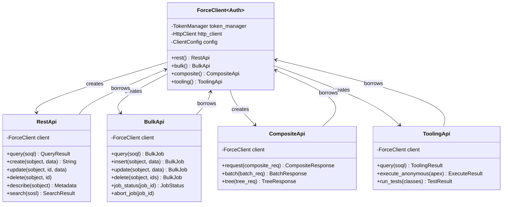

# ADR-006: Handler Pattern for API Operations

**Status:** Accepted
**Date:** 2026-02-07
**Deciders:** Mark M, team-lead
**Context:** How to structure API operations on ForceClient

## Context and Problem Statement

The `ForceClient` needs to expose functionality for 15+ Salesforce API surfaces (REST, Bulk, Composite, Tooling, GraphQL, Pub/Sub, etc.). Each API surface has multiple operations.

**Problem:** How should we structure this API?

### Option A: Methods Directly on Client
```rust
impl<Auth> ForceClient<Auth> {
    pub async fn query(&self, soql: &str) -> Result<QueryResult> { /* ... */ }
    pub async fn create(&self, sobject: &str, data: &Value) -> Result<String> { /* ... */ }
    pub async fn update(&self, sobject: &str, id: &str, data: &Value) -> Result<()> { /* ... */ }
    pub async fn delete(&self, sobject: &str, id: &str) -> Result<()> { /* ... */ }
    pub async fn bulk_query(&self, soql: &str) -> Result<BulkJob> { /* ... */ }
    pub async fn bulk_insert(&self, sobject: &str, data: Vec<Value>) -> Result<BulkJob> { /* ... */ }
    pub async fn composite_request(&self, req: CompositeRequest) -> Result<CompositeResponse> { /* ... */ }
    pub async fn tooling_query(&self, soql: &str) -> Result<ToolingResult> { /* ... */ }
    // ... 50+ more methods ...
}
```

### Option B: Handler Objects
```rust
impl<Auth> ForceClient<Auth> {
    pub fn rest(&self) -> RestApi<'_, Auth> { /* ... */ }
    pub fn bulk(&self) -> BulkApi<'_, Auth> { /* ... */ }
    pub fn composite(&self) -> CompositeApi<'_, Auth> { /* ... */ }
}

// Usage:
let accounts = client.rest().query("SELECT Id FROM Account").await?;
let job = client.bulk().query("SELECT Id FROM Contact").await?;
```

Which approach should we use?

## Decision Drivers

- **Discoverability** - Easy to find operations via IDE autocomplete
- **Namespacing** - Clear organization by API surface
- **Feature gates** - API surfaces are optional (e.g., bulk requires "bulk" feature)
- **Type safety** - Leverage Rust's type system
- **Documentation** - Clear, organized API docs
- **Maintenance** - Easy to add new operations
- **Code organization** - Separate concerns by API surface
- **Testing** - Easy to mock individual API surfaces

## Considered Options

### Option 1: Flat Methods on Client
```rust
impl<Auth: Authenticator> ForceClient<Auth> {
    // REST API
    pub async fn query(&self, soql: &str) -> Result<QueryResult> { /* ... */ }
    pub async fn create(&self, sobject: &str, data: &Value) -> Result<String> { /* ... */ }
    pub async fn update(&self, sobject: &str, id: &str, data: &Value) -> Result<()> { /* ... */ }

    // Bulk API
    #[cfg(feature = "bulk")]
    pub async fn bulk_query(&self, soql: &str) -> Result<BulkJob> { /* ... */ }

    // Composite API
    #[cfg(feature = "composite")]
    pub async fn composite_request(&self, req: CompositeRequest) -> Result<CompositeResponse> { /* ... */ }

    // ... 50+ more methods
}
```

**Usage:**
```rust
let accounts = client.query("SELECT Id FROM Account").await?;
let job = client.bulk_query("SELECT Id FROM Contact").await?;
```

**Pros:**
- Simple, flat API
- Shorter method calls (`client.query()` vs `client.rest().query()`)
- Familiar to users of other HTTP client libraries

**Cons:**
- ❌ **Method explosion** - 50+ methods on single type
- ❌ **Poor namespacing** - `query()` vs `bulk_query()` vs `tooling_query()` - naming conflicts
- ❌ **Hard to discover** - IDE autocomplete shows ALL methods
- ❌ **Tight coupling** - All API logic in one massive impl block
- ❌ **Testing complexity** - Can't mock individual API surfaces
- ❌ **Documentation bloat** - 50+ methods in one place
- ❌ **Feature gate complexity** - Conditional methods scattered throughout

### Option 2: Handler Pattern (CHOSEN)
```rust
impl<Auth: Authenticator> ForceClient<Auth> {
    /// Access REST API operations
    pub fn rest(&self) -> RestApi<'_, Auth> {
        RestApi::new(self)
    }

    /// Access Bulk API operations (requires "bulk" feature)
    #[cfg(feature = "bulk")]
    pub fn bulk(&self) -> BulkApi<'_, Auth> {
        BulkApi::new(self)
    }

    /// Access Composite API operations (requires "composite" feature)
    #[cfg(feature = "composite")]
    pub fn composite(&self) -> CompositeApi<'_, Auth> {
        CompositeApi::new(self)
    }
}

// REST API Handler
pub struct RestApi<'a, Auth> {
    client: &'a ForceClient<Auth>,
}

impl<'a, Auth: Authenticator> RestApi<'a, Auth> {
    pub async fn query(&self, soql: &str) -> Result<QueryResult> { /* ... */ }
    pub async fn create(&self, sobject: &str, data: &Value) -> Result<String> { /* ... */ }
    pub async fn update(&self, sobject: &str, id: &str, data: &Value) -> Result<()> { /* ... */ }
    pub async fn delete(&self, sobject: &str, id: &str) -> Result<()> { /* ... */ }
}

// Bulk API Handler
#[cfg(feature = "bulk")]
pub struct BulkApi<'a, Auth> {
    client: &'a ForceClient<Auth>,
}

#[cfg(feature = "bulk")]
impl<'a, Auth: Authenticator> BulkApi<'a, Auth> {
    pub async fn query(&self, soql: &str) -> Result<BulkJob> { /* ... */ }
    pub async fn insert(&self, sobject: &str, data: Vec<Value>) -> Result<BulkJob> { /* ... */ }
    pub async fn job_status(&self, job_id: &str) -> Result<BulkJobStatus> { /* ... */ }
}
```

**Usage:**
```rust
// Clear namespacing
let accounts = client.rest().query("SELECT Id FROM Account").await?;
let job = client.bulk().query("SELECT Id FROM Contact").await?;
let combined = client.composite().request(req).await?;
```

**Pros:**
- ✅ **Clear namespacing** - `rest().query()`, `bulk().query()`, `tooling().query()`
- ✅ **Organized docs** - Each handler has its own documentation page
- ✅ **Feature isolation** - Handlers are feature-gated
- ✅ **Testable** - Can mock individual handlers
- ✅ **Discoverable** - IDE autocomplete shows `rest()`, `bulk()`, then operations
- ✅ **Separation of concerns** - Each API surface in its own module
- ✅ **Easy to extend** - Add new handler without touching existing code
- ✅ **Smaller impl blocks** - 5-10 methods per handler vs 50+ on client

**Cons:**
- ⚠️ Slightly longer calls (`client.rest().query()` vs `client.query()`)
- ⚠️ More types to document

### Option 3: Module-Level Functions
```rust
pub mod rest {
    pub async fn query(client: &ForceClient<impl Authenticator>, soql: &str) -> Result<QueryResult> { /* ... */ }
}

pub mod bulk {
    pub async fn query(client: &ForceClient<impl Authenticator>, soql: &str) -> Result<BulkJob> { /* ... */ }
}
```

**Usage:**
```rust
use force::{rest, bulk};

let accounts = rest::query(&client, "SELECT Id FROM Account").await?;
let job = bulk::query(&client, "SELECT Id FROM Contact").await?;
```

**Pros:**
- Clear module namespacing
- No handler structs needed

**Cons:**
- ❌ Must pass client as parameter (not ergonomic)
- ❌ Can't leverage `impl` for shared logic
- ❌ Harder to maintain shared state
- ❌ Less idiomatic Rust (prefer methods)

## Decision Outcome

**Chosen: Option 2 - Handler Pattern**

We will use lightweight handler objects that provide namespaced access to API operations. The `ForceClient` exposes factory methods like `rest()`, `bulk()`, `composite()` that return handler objects.

### Architecture



### Implementation Pattern

#### Handler Factory Methods on Client
```rust
impl<Auth: Authenticator> ForceClient<Auth> {
    /// Access REST API operations (SOQL, CRUD, describe, search)
    ///
    /// # Examples
    ///
    /// ```
    /// let accounts = client.rest()
    ///     .query("SELECT Id, Name FROM Account LIMIT 10")
    ///     .await?;
    /// ```
    pub fn rest(&self) -> RestApi<'_, Auth> {
        RestApi::new(self)
    }

    /// Access Bulk API 2.0 operations for large data operations
    ///
    /// Requires `bulk` feature flag.
    #[cfg(feature = "bulk")]
    #[cfg_attr(docsrs, doc(cfg(feature = "bulk")))]
    pub fn bulk(&self) -> BulkApi<'_, Auth> {
        BulkApi::new(self)
    }
}
```

#### Handler Struct with Lifetime
```rust
/// REST API operations handler
///
/// Provides access to Salesforce REST API endpoints including:
/// - SOQL queries
/// - CRUD operations (create, read, update, delete)
/// - Metadata describe
/// - SOSL search
pub struct RestApi<'a, Auth> {
    client: &'a ForceClient<Auth>,
}

impl<'a, Auth> RestApi<'a, Auth> {
    pub(crate) fn new(client: &'a ForceClient<Auth>) -> Self {
        Self { client }
    }
}

impl<'a, Auth: Authenticator> RestApi<'a, Auth> {
    /// Execute a SOQL query
    ///
    /// # Examples
    ///
    /// ```
    /// let result = client.rest()
    ///     .query("SELECT Id, Name FROM Account WHERE Industry = 'Technology'")
    ///     .await?;
    ///
    /// for record in result.records {
    ///     println!("{}: {}", record["Id"], record["Name"]);
    /// }
    /// ```
    pub async fn query(&self, soql: &str) -> Result<QueryResult> {
        let token = self.client.token_manager.get_token().await?;
        let url = format!(
            "{}/services/data/{}/query",
            self.client.config.instance_url,
            self.client.config.api_version
        );

        // Use client's http_client for actual request
        self.client.http_client
            .get(&url)
            .query(&[("q", soql)])
            .bearer_auth(&token)
            .send()
            .await?
            .json()
            .await
    }

    /// Create a new record
    pub async fn create(
        &self,
        sobject: &str,
        data: &serde_json::Value,
    ) -> Result<String> {
        // Similar pattern...
    }
}
```

### Module Structure
```
crates/force/src/
├── client/
│   ├── mod.rs
│   ├── force_client.rs      # ForceClient struct + handler factories
│   └── builder.rs
├── api/
│   ├── mod.rs
│   ├── rest/
│   │   ├── mod.rs            # RestApi handler + tests
│   │   ├── query.rs          # Query-related types
│   │   └── crud.rs           # CRUD types
│   ├── bulk/                 # Feature: bulk
│   │   ├── mod.rs            # BulkApi handler
│   │   ├── job.rs
│   │   └── ingest.rs
│   ├── composite/            # Feature: composite
│   │   ├── mod.rs            # CompositeApi handler
│   │   └── types.rs
│   └── tooling/              # Feature: tooling
│       └── mod.rs            # ToolingApi handler
```

## Usage Examples

### REST API
```rust
// Query
let accounts = client.rest()
    .query("SELECT Id, Name FROM Account LIMIT 5")
    .await?;

// Create
let contact_id = client.rest()
    .create("Contact", &json!({
        "FirstName": "John",
        "LastName": "Doe",
        "Email": "john@example.com"
    }))
    .await?;

// Update
client.rest()
    .update("Contact", &contact_id, &json!({
        "Phone": "555-0100"
    }))
    .await?;

// Delete
client.rest()
    .delete("Contact", &contact_id)
    .await?;
```

### Bulk API
```rust
#[cfg(feature = "bulk")]
{
    // Create bulk query job
    let job = client.bulk()
        .query("SELECT Id, Name, Email FROM Contact")
        .await?;

    // Check job status
    let status = client.bulk()
        .job_status(&job.id)
        .await?;

    // Bulk insert
    let insert_job = client.bulk()
        .insert("Account", vec![
            json!({"Name": "Acme Corp"}),
            json!({"Name": "Globex Inc"}),
        ])
        .await?;
}
```

### Composite API
```rust
#[cfg(feature = "composite")]
{
    let composite_req = CompositeRequest::builder()
        .add_query("accounts", "SELECT Id FROM Account LIMIT 5")
        .add_query("contacts", "SELECT Id FROM Contact LIMIT 5")
        .build();

    let result = client.composite()
        .request(composite_req)
        .await?;
}
```

### Chaining Operations
```rust
// Each handler method is independent
let account_id = client.rest()
    .create("Account", &json!({"Name": "Test Corp"}))
    .await?;

let account = client.rest()
    .get("Account", &account_id)
    .await?;

client.rest()
    .update("Account", &account_id, &json!({"Industry": "Technology"}))
    .await?;
```

## Consequences

### Positive

✅ **Clear namespacing** - `rest().query()` vs `bulk().query()` - no ambiguity
✅ **Feature isolation** - Handlers are feature-gated, won't compile without feature
✅ **Organized documentation** - Each handler on separate docs page
✅ **IDE discoverability** - Type `client.` → see handler options, then operations
✅ **Testability** - Can mock handlers independently
✅ **Separation of concerns** - Each API surface in its own module
✅ **Maintainability** - Add new operations to handler without touching client
✅ **Zero runtime cost** - Handlers are lightweight borrows (`&'a ForceClient`)
✅ **Type safety** - Handlers can have different type parameters if needed

### Negative

⚠️ **Slightly longer calls** - `client.rest().query()` vs `client.query()`
⚠️ **More types** - Each handler is a separate type to document
⚠️ **Lifetime parameters** - Handlers have `'a` lifetime tied to client

### Neutral

ℹ️ **Pattern familiarity** - Common in HTTP clients (e.g., AWS SDK)
ℹ️ **Handler reuse** - Same handler can be called multiple times (cheap borrow)
ℹ️ **Extension trait alternative** - Could use extension traits, but handlers are clearer

## Alternative Patterns in Ecosystem

### AWS SDK (Similar Handler Pattern)
```rust
let s3_client = aws_sdk_s3::Client::new(&config);
let dynamodb_client = aws_sdk_dynamodb::Client::new(&config);

// Separate clients for separate services (similar to our handlers)
```

### Reqwest (Flat Methods)
```rust
let resp = reqwest::get("https://api.example.com").await?;
// Simple, but reqwest is a general HTTP client, not multi-API client
```

### Octocrab (GitHub Client - Handler Pattern)
```rust
let octocrab = octocrab::instance();
let issues = octocrab.issues("owner", "repo").list().await?;
let pulls = octocrab.pulls("owner", "repo").list().await?;
// Similar pattern: handlers for different API surfaces
```

## Testing

```rust
#[cfg(test)]
mod tests {
    use super::*;

    #[tokio::test]
    async fn test_rest_api_handler() {
        let client = mock_force_client();
        let rest = client.rest();

        // Handler is lightweight, can create multiple times
        let rest2 = client.rest();

        // Both reference same client
        assert_eq!(
            rest.client as *const _,
            rest2.client as *const _
        );
    }

    #[tokio::test]
    async fn test_handler_feature_gating() {
        let client = mock_force_client();

        // REST always available
        let _rest = client.rest();

        // Bulk only with feature
        #[cfg(feature = "bulk")]
        let _bulk = client.bulk();

        // Won't compile without feature:
        // #[cfg(not(feature = "bulk"))]
        // let _bulk = client.bulk();  // ERROR!
    }
}
```

## Validation

This decision will be validated through:
1. Implementation of RestApi handler with TDD
2. Developer feedback on API ergonomics
3. Documentation clarity and organization
4. IDE autocomplete experience
5. Ease of adding new API surfaces

## Related Decisions

- [ADR-001](001-workspace-structure.md) - Module structure for handlers
- [ADR-002](002-authentication-strategy.md) - Handlers use client's authenticator
- [ADR-004](004-feature-gates.md) - Handlers are feature-gated
- [ADR-005](005-compile-time-auth-safety.md) - Client creation requires auth

## References

- [AWS SDK for Rust](https://github.com/awslabs/aws-sdk-rust) - Service client pattern
- [Octocrab (GitHub API)](https://docs.rs/octocrab/) - Handler pattern
- [google-cloud-rust](https://github.com/yoshidan/google-cloud-rust) - Similar approach
- [Builder Pattern](https://rust-unofficial.github.io/patterns/patterns/creational/builder.html)
