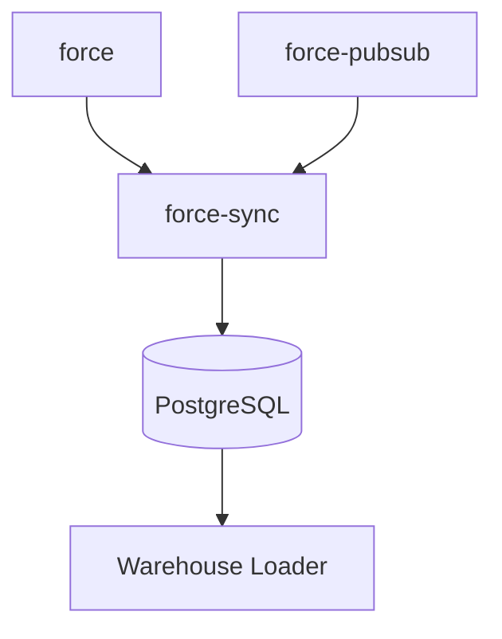

# ADR-026: Create `force-sync` as a Postgres-First Sync Engine

**Status:** Accepted
**Date:** 2026-03-25
**Deciders:** Mark

## Context

`force-rs` now covers Salesforce transport and API surfaces well:

- `force` handles REST, Bulk, Composite, GraphQL, and related HTTP APIs
- `force-pubsub` handles Salesforce Pub/Sub and CDC streams

What it does not provide is a durable, enterprise-grade sync engine for
bidirectional convergence between Salesforce and PostgreSQL.

That missing layer needs more than HTTP or gRPC calls. It needs:

- canonical record identity across systems
- durable journals and checkpoints
- retry-safe apply semantics
- conflict handling
- anti-entropy and replay
- a warehouse-friendly operational history

Adding those concerns directly into `force` would bloat the core crate for
users who only need API access. At the same time, a lowest-common-denominator
storage abstraction would compromise the concurrency and recovery properties
needed for a serious sync engine.

## Decision Drivers

- Correctness under retries, duplicates, gaps, and restarts
- Separation of concerns from the core Salesforce client crates
- Async-native runtime fit with the existing Tokio stack
- Strong operational behavior for enterprise PostgreSQL deployments
- Future compatibility with downstream warehouse export
- Avoiding lowest-common-denominator database design
- Avoiding ORM-shaped abstractions for queue/journal/control-plane work

## Considered Options

### 1. Build sync into the `force` crate

- **Pros:** single dependency for users
- **Cons:** bloats the core crate, mixes transport APIs with durable sync state,
  forces non-sync users to pay complexity they do not need

### 2. Create a separate sync crate with generic multi-backend storage from day one

- **Pros:** looks flexible on paper, easier to pitch as reusable
- **Cons:** pushes the design toward lowest-common-denominator SQL, adds
  abstraction cost before the second backend exists, weakens the Postgres
  concurrency model needed for correctness

### 3. Create a separate Postgres-first sync crate using Diesel

- **Pros:** strong type mapping, mature migrations story
- **Cons:** the sync engine is queue/journal/control-plane work, not ORM-shaped
  CRUD; Diesel is a poor fit for async worker-heavy orchestration and advanced
  Postgres operational SQL

### 4. Create a separate Postgres-first sync crate with async-native SQL

- **Pros:** preserves clean crate boundaries, fits the worker/journal model,
  allows explicit Postgres semantics, aligns with enterprise operational needs
- **Cons:** requires a Postgres dependency and defers SQLite/direct warehouse
  sinks to later work

## Decision

Create `crates/force-sync` as a standalone workspace crate for bidirectional
Salesforce/PostgreSQL sync.

### Key Design Commitments

1. **`force-sync` is its own crate**
   - `force` stays focused on Salesforce APIs
   - `force-pubsub` stays focused on Pub/Sub transport
   - `force-sync` owns durable sync semantics

2. **PostgreSQL is the only v0.1 backend**
   - Postgres is both the control plane and the durable recovery source
   - SQLite is explicitly deferred

3. **Canonical identity is external-ID based**
   - canonical key: `(tenant, object_name, external_id)`
   - Salesforce IDs and local primary keys are aliases

4. **The sync engine is planner-driven**
   - merge first
   - select the cheapest safe apply lane second
   - supported lanes: REST, Composite Graph, Bulk

5. **The engine stores both journal history and operational state**
   - append-only journal
   - link/shadow state
   - durable task queue
   - checkpoints
   - conflicts
   - dead letters
   - export watermarks

6. **Warehouse delivery is downstream from Postgres**
   - `force-sync` must preserve warehouse-friendly history
   - direct warehouse connectors are not part of v0.1

7. **Diesel is not the chosen database layer**
   - prefer explicit SQL with an async-native Postgres client

## Architecture Sketch

## Consequences

### Positive

- **Clean separation of responsibilities.**
  Users who only need Salesforce API access do not pay for sync-state
  machinery.
- **Correctness-oriented storage model.**
  Postgres can support journals, leased work queues, checkpoints, and replay
  without awkward compromise.
- **External-ID based convergence.**
  The engine is resilient to Salesforce ID churn and upsert response quirks.
- **Future warehouse compatibility.**
  Journal-first design makes downstream incremental export straightforward.
- **Planner-driven transport choice.**
  The engine can use REST, Composite Graph, or Bulk based on actual workload.

### Negative

- **New workspace crate and dependency surface.**
  Users who want sync now depend on another crate.
- **Postgres is required for v0.1.**
  Embedded/no-service deployment is deferred.
- **SQLite is intentionally excluded.**
  This reduces flexibility for local or single-process scenarios until a later
  backend exists.
- **Direct warehouse sinks are deferred.**
  Enterprises must load warehouses from Postgres first.

## Validation

This decision is successful when:

1. `force-sync` can resume from restart without duplicate side effects
2. journal replay is idempotent
3. one-object bidirectional sync works end to end using external-ID identity
4. backlog can spill from REST lanes to Bulk lanes without changing correctness
5. downstream consumers can incrementally export by journal watermark
6. users of `force` and `force-pubsub` who do not adopt sync pay zero sync cost

## Related Decisions

- [ADR-001](001-workspace-structure.md) - Workspace structure and module organization
- [ADR-004](004-feature-gates.md) - Feature flag strategy for API surfaces
- [ADR-018](018-force-pubsub-crate.md) - Implement Pub/Sub as a separate workspace crate

## References

- [Force Sync Design](../plans/2026-03-25-force-sync-design.md)
