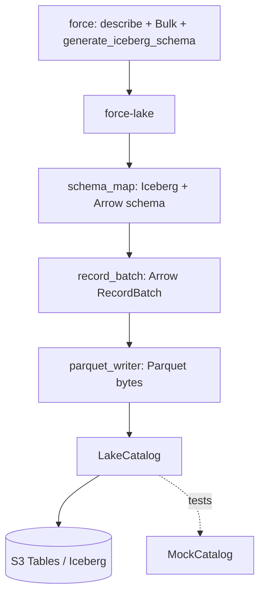

# ADR-028: Create `force-lake` as a Salesforce → Iceberg Snapshot Sink

**Status:** Accepted
**Date:** 2026-07-13
**Deciders:** Mark

## Context

`force-rs` covers Salesforce transport, API surfaces, and — with `force-sync` —
bidirectional Salesforce/PostgreSQL convergence. What it does not provide is an
analytics landing zone: a way to materialize Salesforce objects into an open
table format (Apache Iceberg on Amazon S3 Tables) for warehouse/lakehouse
querying by Athena, Trino, Spark, or Snowflake.

That layer is fundamentally different from `force-sync`:

- it is **one-way** (Salesforce → lake) — the lake is never read back to drive
  Salesforce;
- it targets **columnar files (Parquet) and an Iceberg catalog**, not a
  transactional control plane;
- its correctness bar is *snapshot fidelity and schema fidelity*, not
  retry-safe bidirectional apply.

Trying to host this inside `force-sync` would be a category error: `force-sync`
is a bidirectional Salesforce↔Postgres control plane with jsonb-only storage, no
`Sink` trait, and applies that are coupled to read-back convergence. None of
that fits an append-only, schema-on-write, columnar analytics sink.

## Decision Drivers

- Clean separation from the transactional sync engine and the core client
- An open, queryable table format (Iceberg) rather than a proprietary sink
- Faithful Salesforce → columnar type mapping, reusing existing schema tooling
- Keeping heavy analytics dependencies (Arrow, Parquet, iceberg-rust) out of the
  `force` core crate and out of the shared workspace dependency set
- Pragmatism about iceberg-rust's pre-1.0 maturity and S3 Tables' constraints

## Considered Options

### 1. Add an Iceberg sink to `force-sync`

- **Pros:** one crate for "get Salesforce data out"
- **Cons:** wrong host — `force-sync` is bidirectional, jsonb-only, control-plane
  shaped; an analytics sink is one-way, columnar, schema-on-write. Bloats the
  sync engine's dependency surface with Arrow/Parquet/iceberg.

### 2. Add Iceberg generation into the `force` crate

- **Pros:** no new crate
- **Cons:** drags Arrow/Parquet/iceberg-rust (and their arrow major-version pins)
  into the core client that most users never need.

### 3. New sibling crate, CDC-first via `force-pubsub`

- **Pros:** near-real-time freshness
- **Cons:** CDC needs a backfill/bootstrap path and exactly-once merge into
  Iceberg — much larger first cut. No snapshot baseline to build on.

### 4. New sibling crate, snapshot-first via Bulk API (chosen)

- **Pros:** smallest correct first cut; a full-object Bulk read → Parquet →
  Iceberg append is self-contained and testable; establishes the schema/type
  mapping and catalog seam that a later CDC path can reuse.
- **Cons:** snapshot freshness, not streaming; row-level deletes are not yet
  expressible from Rust iceberg.

## Decision

Create `crates/force-lake` as a standalone workspace crate: a one-way Salesforce
→ S3 Tables / Apache Iceberg analytics snapshot sink.

### Key Design Commitments

1. **`force-lake` is its own crate.** `force` stays API-focused; `force-sync`
   stays the bidirectional Postgres control plane; `force-lake` owns the columnar
   analytics sink. Heavy deps (Arrow, Parquet, iceberg-rust) are crate-local, not
   in the shared workspace dependency table.

2. **Snapshot first, CDC later.** v0.1 materializes a full snapshot per object
   via the Bulk API. CDC ingestion via `force-pubsub` is a documented follow-up
   and shares **no** backfill path with the snapshot flow.

3. **Schema mapping is owned by `force`, consumed by `force-lake`.** The
   canonical Salesforce → Iceberg type mapping lives in
   `force::schema::generate_iceberg_schema` (feature `schema`), which emits an
   Iceberg schema *document* as `serde_json::Value`. `force-lake` deserializes it
   into `iceberg::spec::Schema` and derives the Arrow schema. This keeps the type
   mapping next to the other schema generators (BigQuery, Avro, etc.) without
   putting Arrow/Iceberg types into `force`.

4. **Append / full-partition overwrite only — no native Rust row deletes.**
   iceberg-rust does not yet offer ergonomic row-level deletes from Rust, so the
   sink appends data files and (for period-scoped refreshes) overwrites whole
   partitions. Row-level upsert / `MERGE` is deferred to a documented
   Athena-`MERGE` path executed outside this crate.

5. **The catalog is behind a trait with a real and a mock implementation.**
   `LakeCatalog` (`ensure_table` + `commit_snapshot`) decouples the pure pipeline
   (describe → schema → record batches → Parquet) from physical Iceberg I/O.
   `MockCatalog` drives unit tests; `S3TablesCatalog` binds the real
   iceberg-rust generic `iceberg::Catalog` trait.

6. **Testable pure core.** `SnapshotSink::snapshot_from_records` contains the
   Salesforce-free pipeline (batch → Parquet → commit) and is unit-tested with
   `MockCatalog` and hand-fed records; `snapshot_object` only adds describe +
   Bulk fetch on top.

## Architecture Sketch

## Type Mapping

Salesforce `FieldType` → Iceberg primitive (then Iceberg → Arrow via iceberg-rust):

| Salesforce `FieldType` | Iceberg type | Arrow type |
|---|---|---|
| String, Picklist, Multipicklist, Combobox, Reference, Textarea, Phone, Id, Url, Email, Encryptedstring, Datacategorygroupreference, Location, Address, AnyType | `string` | `Utf8` |
| Base64 | `binary` | `Binary` |
| Int | `int` | `Int32` |
| Currency, Percent, Double (precision 1–38, scale ≥ 0) | `decimal(p,s)` | `Decimal128(p,s)` |
| Currency, Percent, Double (otherwise) | `double` | `Float64` |
| Boolean | `boolean` | `Boolean` |
| Date | `date` | `Date32` |
| Datetime | `timestamptz` | `Timestamp(µs, +00:00)` |
| Time | `time` | `Time64(µs)` |

Note: Salesforce `Long` is not a distinct `FieldType` variant, so the widest
integer variant (`Int`) maps to Iceberg `int` / Arrow `Int32`. Field ids are
assigned monotonically from 1 in a stable `Id`-first order; `required = !nillable`.

## Consequences

### Positive

- **Clean separation.** API-only and sync-only users pay zero analytics cost;
  Arrow/Parquet/iceberg stay out of `force` and out of `force-sync`.
- **Open format.** Output is queryable by any Iceberg-aware engine.
- **Shared type mapping.** Iceberg schema generation sits beside the other
  `force::schema` generators and is unit-tested there.
- **Testable without AWS.** The pure pipeline is exercised end-to-end with a mock
  catalog; only the physical S3 commit needs a live backend.

### Negative

- **Snapshot freshness, not streaming.** CDC is deferred.
- **No row-level deletes yet.** Append + full-partition overwrite only; `MERGE`
  is an out-of-band Athena step.
- **Pre-1.0 dependency churn.** iceberg-rust and its pinned Arrow major version
  will move; versions are pinned to contain the blast radius.
- **Deferred concrete S3 Tables catalog binding.** See Risks.

## Risks and Mitigations

- **iceberg-rust pre-1.0 API churn.** Pin exact versions (`iceberg = 0.6.0`,
  which dictates `arrow-* = 55` and `parquet = 55`). Upgrades are deliberate.
- **`iceberg-catalog-s3tables` MSRV.** The dedicated S3 Tables catalog crate
  currently requires rustc 1.92, beyond this workspace's 1.85 MSRV, so it is
  **not** a dependency. `S3TablesCatalog` is written against the generic
  `iceberg::Catalog` trait: `ensure_table` creates the namespace + table for
  real, and `commit_snapshot` performs the real physical Parquet staging write
  via the table's `FileIO`. Constructing the Iceberg `DataFile` manifest entry
  and issuing the `fast_append` metadata commit is the **documented final wiring
  step**, completed once the concrete catalog builder is available on the pinned
  toolchain. This is the only stubbed seam; everything else is real.
- **S3 Tables REST quirks.** Single-level namespaces (enforced in `LakeConfig`
  and `S3TablesCatalog::new`), no `CREATE TABLE AS SELECT` (tables are created
  explicitly then appended), and a metadata.json size ceiling (>50 MB rejected) —
  mitigated by relying on S3 Tables' automatic compaction rather than emitting
  oversized manifests.

## Validation

This decision is successful when:

1. `force::schema::generate_iceberg_schema` produces a document that
   `iceberg::spec::Schema` deserializes, with correct ids/required/types.
2. `schema_map` derives an Arrow schema whose field count and types match.
3. `record_batch` maps JSON scalars (incl. nulls, decimals, dates, datetimes)
   into a valid Arrow `RecordBatch`.
4. `parquet_writer` output round-trips through the Parquet reader.
5. `SnapshotSink::snapshot_from_records` batches, encodes, and commits through a
   catalog, verified with `MockCatalog`.
6. Users of `force`, `force-pubsub`, and `force-sync` who do not adopt the lake
   pay zero analytics-dependency cost.

## Related Decisions

- [ADR-001](001-workspace-structure.md) - Workspace structure and module organization
- [ADR-004](004-feature-gates.md) - Feature flag strategy for API surfaces
- [ADR-018](018-force-pubsub-crate.md) - Pub/Sub as a separate workspace crate
- [ADR-026](026-force-sync-crate.md) - Postgres-first bidirectional sync engine

## References

- [Apache Iceberg Rust](https://github.com/apache/iceberg-rust)
- [Amazon S3 Tables](https://docs.aws.amazon.com/AmazonS3/latest/userguide/s3-tables.html)
