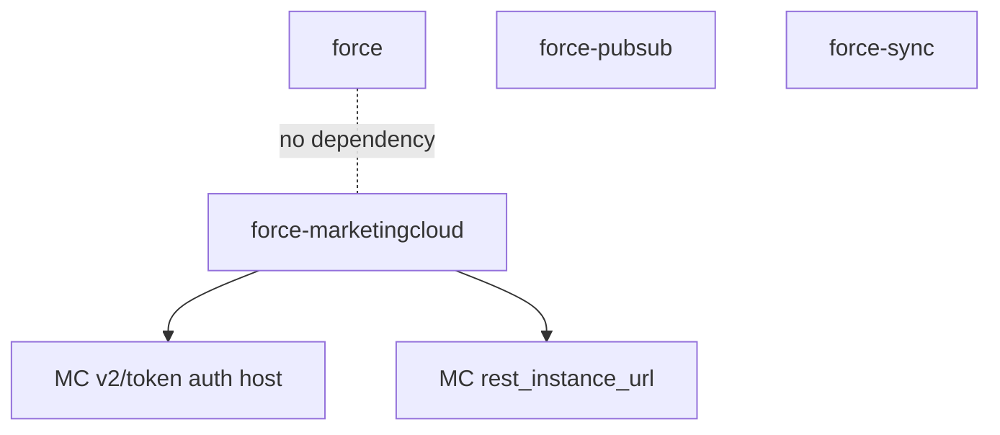

# ADR-034: Create `force-marketingcloud` as a Standalone Engagement Crate

**Status:** Accepted
**Date:** 2026-07-12
**Deciders:** Mark

## Context

`force-rs` covers the Salesforce **Platform** (core CRM) API ecosystem well:
`force` handles REST, Bulk, Composite, GraphQL, Tooling, UI, and related HTTP
surfaces, while `force-pubsub` handles Pub/Sub streaming and `force-sync` handles
durable Salesforce/Postgres convergence.

Salesforce **Marketing Cloud Engagement** (formerly ExactTarget) is a different
product with a different API stack. Adding it to `force` is tempting for the sake
of a single dependency, but Marketing Cloud breaks nearly every invariant the
core client's authentication and session model is built on:

- **Per-tenant auth subdomain.** The token endpoint lives at
  `https://{tenant_subdomain}.auth.marketingcloudapis.com/v2/token`, not a shared
  `login.salesforce.com` / My Domain host.
- **Installed-Package JSON client credentials.** The token request body is JSON
  (`{grant_type, client_id, client_secret, account_id, scope}`), not the
  form-encoded OAuth body the core `ClientCredentials` authenticator sends.
- **~20-minute tokens with NO refresh token.** "Refresh" is simply
  re-authentication; there is no refresh-token rotation to model.
- **Two instance URLs per token.** The response returns both `rest_instance_url`
  and `soap_instance_url`, which are the authoritative bases for subsequent calls
  — the core `AccessToken` models a single `instance_url`.
- **Business-unit (MID) tenancy.** A token can be scoped to a business unit via
  `account_id`; a single set of credentials commonly targets many MIDs, each
  needing its own cached token.

Forcing these differences into `force`'s phantom-typed builder, `Session`, and
single-token `TokenManager` would either distort the core types or bolt on a
parallel code path that the rest of the crate does not use.

## Decision Drivers

- Keep the core `force` auth model (phantom type-state, single `instance_url`,
  refresh-token support) clean and undistorted.
- Model Marketing Cloud's auth accurately: JSON client credentials, dual instance
  URLs, no refresh token, MID tenancy.
- Let users who only need the Platform API avoid pulling in Engagement code, and
  vice versa.
- Fit the existing async/Tokio + reqwest + secrecy + thiserror stack and the
  workspace lint discipline.
- REST first: deliver the high-value REST surfaces now, defer SOAP.

## Considered Options

### 1. Add Marketing Cloud as a feature inside `force`

- **Pros:** single crate/dependency for users.
- **Cons:** the core `Authenticator`/`AccessToken`/`Session`/builder assume a
  single Salesforce OAuth model; MC's per-tenant subdomain, JSON credentials,
  dual instance URLs, refresh-token absence, and MID tenancy would either bloat
  or fork those types. Non-MC users pay for the complexity.

### 2. Standalone crate that depends on `force` for shared auth plumbing

- **Pros:** some code reuse (token structs, HTTP helpers).
- **Cons:** the shared pieces do not actually fit (different token shape, dual
  URLs, JSON body), so reuse is superficial and creates a coupling that would
  force `force` to expose internals purely for MC's benefit.

### 3. Standalone, fully decoupled crate (chosen)

- **Pros:** models MC auth exactly, clean crate boundary, zero cost to non-MC
  users, independent versioning of MC surfaces.
- **Cons:** a small amount of deliberate duplication (its own `AccessToken`,
  `TokenManager`, `Authenticator`).

## Decision

Create `crates/force-marketingcloud` as a standalone workspace crate for the
Marketing Cloud Engagement REST API, decoupled from the `force` path crate.

### Key Design Commitments

1. **Standalone and decoupled.**
   The crate does **not** depend on `force`. It defines its own
   `MarketingCloudError`, `AccessToken`, `Authenticator`, and `TokenManager`.
   The intentional duplication buys an accurate auth model and a clean boundary.

2. **Installed-Package client-credentials auth.**
   `InstalledPackageCredentials` posts a JSON body to
   `{tenant}.auth.marketingcloudapis.com/v2/token` and parses the dual
   `rest_instance_url` / `soap_instance_url` plus a hard expiry.

3. **Proactive, per-MID token management.**
   `TokenManager` caches tokens keyed by the effective `account_id` override
   (`Option<String>`, where `None` is the builder default). Because there is no
   refresh token, it proactively re-authenticates once a token enters a 60-second
   soft-expiry window, using a per-key single-flight lock so concurrent callers
   trigger at most one auth request per business unit.

4. **REST-first; SOAP deferred.**
   Transactional Messaging, Content Builder Assets, Contacts, Data Extensions,
   and Journeys ship as typed handlers, plus a raw escape hatch. The SOAP
   instance URL is captured but a typed SOAP client is out of scope.

5. **Handler pattern and workspace conventions.**
   Lightweight handlers borrow the client (mirroring `force`), a synchronous
   builder validates configuration with lazy first-call auth, and the crate obeys
   the workspace lints (no `unsafe`, `missing_docs`, clippy pedantic/nursery,
   no `unwrap`/`expect` in production code).

## Architecture Sketch

## Consequences

### Positive

- **Accurate auth model.** JSON client credentials, dual instance URLs, no
  refresh token, and MID tenancy are modeled directly instead of shoehorned.
- **Clean separation.** Platform-only users pay nothing for Engagement; the core
  `force` auth types stay undistorted.
- **Correct concurrency.** Per-MID single-flight caching avoids token stampedes
  and cross-business-unit token bleed.
- **Independent evolution.** MC surfaces can grow (definitions, batch events,
  SOAP) without touching the core crate.

### Negative

- **Deliberate duplication.** A second `AccessToken` / `TokenManager` /
  `Authenticator` exists; fixes to shared concepts must be applied in two places.
- **Another workspace crate.** Users adopting Engagement take on an additional
  dependency.
- **SOAP not yet covered.** Legacy SOAP-only Marketing Cloud operations require
  the raw escape hatch or a future addition.

## Validation

This decision is successful when:

1. A client authenticates against a mocked `v2/token` and reuses the cached token
   across REST calls.
2. A soft-expired token is proactively re-fetched without a refresh token.
3. A per-call MID override fetches and caches a distinct token.
4. Transactional email/SMS, assets, contacts, data extensions, and journeys each
   issue the documented method/path/body and parse their responses.
5. Both documented error-envelope shapes deserialize into `MarketingCloudError::Api`.
6. Users of `force` who do not adopt Engagement pay zero Engagement cost.

## Related Decisions

- [ADR-002](002-authentication-strategy.md) - Authentication trait design and flow support
- [ADR-006](006-handler-pattern.md) - Handler pattern for API organization
- [ADR-018](018-force-pubsub-crate.md) - Implement Pub/Sub as a separate workspace crate
- [ADR-026](026-force-sync-crate.md) - Create `force-sync` as a separate Postgres-first crate

## References

- [Marketing Cloud server-to-server access tokens](https://developer.salesforce.com/docs/marketing/marketing-cloud/guide/access-token-s2s.html)
- [Transactional Messaging API](https://developer.salesforce.com/docs/marketing/marketing-cloud/guide/transactional-messaging-api.html)
- [Marketing Cloud REST error handling](https://developer.salesforce.com/docs/marketing/marketing-cloud/guide/error-handling.html)
