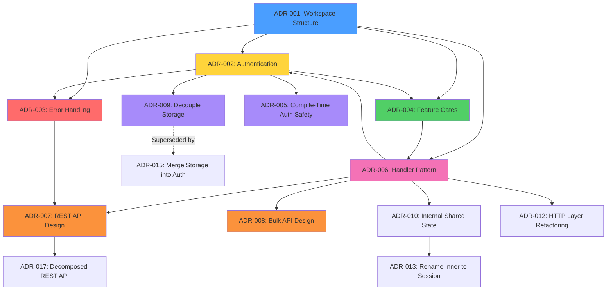

# Architecture Decision Records (ADRs)

This directory contains Architecture Decision Records (ADRs) for force-rs. ADRs document significant architectural and design decisions made during the development of the project.

## What is an ADR?

An Architecture Decision Record (ADR) captures a single architectural decision and its context. Each ADR describes:
- The context and problem statement
- The decision drivers and constraints
- Options considered
- The chosen decision and rationale
- Consequences (positive, negative, neutral)
- Related decisions

## Format

ADRs follow this structure:
1. **Title** - Decision number and descriptive name
2. **Status** - Proposed, Accepted, Deprecated, Superseded
3. **Date** - When the decision was made
4. **Deciders** - Who made the decision
5. **Context** - Problem statement and background
6. **Decision Drivers** - Constraints and requirements
7. **Considered Options** - Alternatives evaluated
8. **Decision Outcome** - What was chosen and why
9. **Consequences** - Positive/negative/neutral impacts
10. **Validation** - How success will be measured
11. **Related Decisions** - Links to other ADRs
12. **References** - External documentation

## Index

### Foundation Phase

| ADR | Title | Status | Date |
|-----|-------|--------|------|
| [001](001-workspace-structure.md) | Workspace Structure and Module Organization | Accepted | 2026-02-07 |
| [002](002-authentication-strategy.md) | Authentication Strategy and Trait Design | Accepted | 2026-02-07 |
| [003](003-error-handling.md) | Error Handling Strategy with thiserror | Accepted | 2026-02-07 |
| [004](004-feature-gates.md) | Feature Flag Strategy for API Surfaces | Accepted | 2026-02-07 |
| [005](005-compile-time-auth-safety.md) | Compile-Time Auth Safety with Phantom Types | Accepted | 2026-02-07 |
| [006](006-handler-pattern.md) | Handler Pattern for API Operations | Accepted | 2026-02-07 |
| [007](007-rest-api-design.md) | REST API Design Decisions | Accepted | 2026-02-07 |
| [008](008-bulk-api-design.md) | Bulk API 2.0 Design Decisions | Accepted | 2026-02-08 |
| [009](009-decouple-storage-from-core.md) | Decouple Storage from Core | Superseded | 2026-02-17 |
| [010](010-internal-shared-state.md) | Internal Shared State Pattern | Accepted | 2026-02-17 |
| [011](011-remove-pub-sub-support.md) | Remove Pub/Sub Support | Accepted | 2024-05-22 |
| [012](012-http-layer-refactoring.md) | HTTP Layer Refactoring & Observability | Accepted | 2026-02-17 |
| [013](013-rename-inner-to-session.md) | Rename Inner to Session | Accepted | 2026-02-18 |
| [014](014-query-plan-support.md) | Query Plan Support | Accepted | 2026-02-18 |
| [015](015-merge-storage-into-auth.md) | Merge Storage Logic into Auth | Accepted | 2026-02-18 |
| [016](016-isolate-auth-types.md) | Isolate Auth Types | Accepted | 2026-03-02 |
| [017](017-decomposed-rest-api.md) | Decomposed REST API Module | Accepted | 2026-03-05 |
| [018](018-force-pubsub-crate.md) | Implement Pub/Sub as a Separate Workspace Crate | Accepted | 2026-03-17 |
| [019](019-tooling-api-design.md) | RestOperation Trait and Tooling API Design | Accepted | 2026-03-19 |
| [020](020-ui-api-design.md) | UI API Design | Accepted | 2026-03-20 |
| [021](021-graphql-api-design.md) | GraphQL API Design | Accepted | 2026-03-20 |
| [022](022-data-cloud-api-design.md) | Data Cloud API Design | Accepted | 2026-03-21 |
| [023](023-apex-rest-cpq-design.md) | Apex REST and CPQ API Design | Accepted | 2026-03-21 |
| [024](024-consent-portability-api-design.md) | Consent & Portability API Design | Accepted | 2026-03-21 |
| [025](025-username-password-auth.md) | Username-Password Authentication Flow | Accepted | 2026-03-22 |
| [026](026-force-sync-crate.md) | Create `force-sync` as a Postgres-First Sync Engine | Accepted | 2026-03-25 |

## Decision Process

When making significant architectural decisions:

1. **Identify the decision** - What needs to be decided?
2. **Research options** - What are the alternatives?
3. **Evaluate tradeoffs** - Pros/cons of each option
4. **Make decision** - Choose and document rationale
5. **Create ADR** - Document in this directory
6. **Review** - Get team feedback
7. **Accept** - Mark as accepted and implement
8. **Validate** - Verify assumptions through implementation

## Relationships Between ADRs

## Key Decisions Summary

### ADR-001: Workspace Structure
- **Decision**: Use Cargo workspace with single `force` library crate in `crates/force/`
- **Rationale**: Ready for future expansion while keeping initial complexity low
- **Impact**: Clear module boundaries, workspace-level lints

### ADR-002: Authentication Strategy
- **Decision**: Trait-based `Authenticator` with generic `ForceClient<Auth>`
- **Rationale**: Compile-time auth safety, zero-cost abstraction, extensible
- **Impact**: Can't create unauthenticated clients, type-safe auth flows

### ADR-003: Error Handling
- **Decision**: Hierarchical error types with `thiserror`
- **Rationale**: Type-safe error handling, clear error context for callers
- **Impact**: Users can match on specific errors, `?` operator works seamlessly

### ADR-004: Feature Gates
- **Decision**: Fine-grained features for API surfaces (default: `rest`)
- **Rationale**: Zero-cost abstraction, only compile what's needed
- **Impact**: Fast compile times, small binaries, opt-in dependencies

### ADR-005: Compile-Time Auth Safety
- **Decision**: Phantom type state pattern for builder
- **Rationale**: Prevent unauthenticated clients at compile time
- **Impact**: `ForceClientBuilder<State>` with type transitions, zero runtime cost

### ADR-006: Handler Pattern
- **Decision**: Lightweight handler objects for API operations (`client.rest()`, `client.bulk()`)
- **Rationale**: Clear namespacing, feature isolation, organized documentation
- **Impact**: Slightly longer calls but better organization and discoverability

### ADR-007: REST API Design
- **Decision**: Hybrid approach with both dynamic (`query()`) and typed (`query_typed<T>()`) methods
- **Rationale**: Flexibility for dynamic queries, type safety when needed, zero-cost abstraction
- **Impact**: Two query patterns to learn, but clear upgrade path from dynamic to typed

### ADR-008: Bulk API Design
- **Decision**: Use typestate pattern for job lifecycle and feature gates
- **Rationale**: Compile-time safety for complex job states, optional bloat
- **Impact**: Safe but verbose API, smaller binaries for non-bulk users

### ADR-009: Decouple Storage from Core
- **Decision**: Move persistence logic to a dedicated crate/boundary
- **Rationale**: Resolve circular dependencies and improve build times
- **Impact**: Modular architecture but increased complexity

### ADR-033: Tiered, Env-Gated Live-Contract Test Harness
- **Decision**: Add sibling live-test binaries (`live_core`, `live_special`, `live_account_engagement`, and the MC crate's `live_marketingcloud`) plus a shared `tests/common/mod.rs`, leaving `live_salesforce.rs` untouched
- **Rationale**: Broader live coverage with per-surface env tiers, skip-not-fail, and a single credential contract, without editing the contention-prone existing file
- **Impact**: More live coverage and clean partial-credential CI runs, at the cost of a duplicated auth loader between the two harnesses

## Contributing ADRs

When adding a new ADR:

1. Use the next sequential number (e.g., `005-title.md`)
2. Follow the standard ADR template
3. Include mermaid diagrams for architecture
4. Link related ADRs bidirectionally
5. Update this README index
6. Get team review before marking as "Accepted"

## Status Meanings

- **Proposed** - Under discussion, not yet decided
- **Accepted** - Decision made and documented
- **Deprecated** - No longer applicable
- **Superseded** - Replaced by another ADR (link to successor)

## References

- [ADR Template](https://github.com/joelparkerhenderson/architecture-decision-record)
- [Why ADRs](https://cognitect.com/blog/2011/11/15/documenting-architecture-decisions)
- [Mark's Coding Standards](C:\Users\markm\.claude\CLAUDE.md) - "ADRs for significant decisions"
