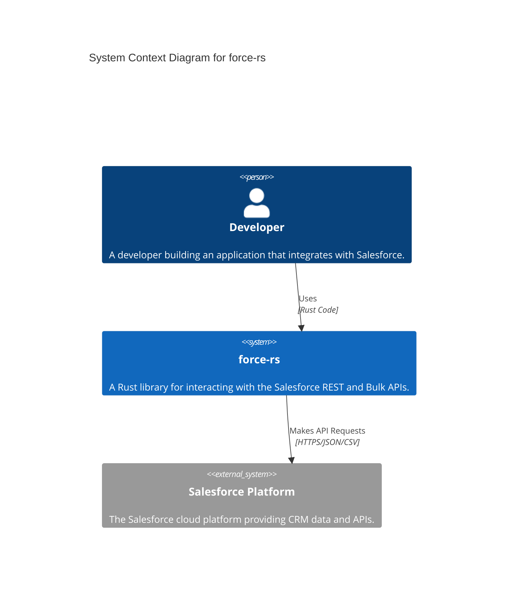
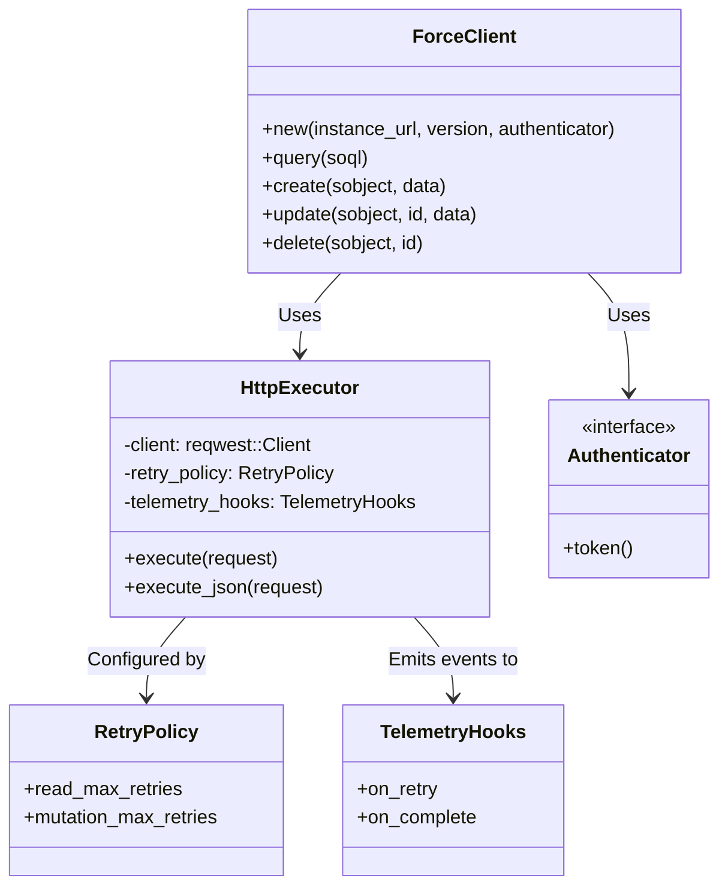

# Architecture Documentation

This document describes the high-level architecture of the `force-rs` library.

## C4 System Context

The following diagram illustrates the system context for `force-rs`.



## Component Diagram

The following class diagram illustrates the core components of the library, focusing on the HTTP execution layer.



## Sequence Diagram: Request Retry Logic

The following sequence diagram illustrates how the `HttpExecutor` handles transient failures like rate limits and authentication expiration.

```mermaid
sequenceDiagram
    participant User
    participant ForceClient
    participant HttpExecutor
    participant Salesforce

    User->>ForceClient: query("SELECT Id FROM Account")
    ForceClient->>HttpExecutor: execute(request)

    loop Retry Loop
        HttpExecutor->>Salesforce: HTTP Request (Token A)

        alt 429 Too Many Requests
            Salesforce-->>HttpExecutor: 429 (Retry-After: 2)
            HttpExecutor->>HttpExecutor: Sleep(2s)
            note right of HttpExecutor: Retry after delay
        else 503 Service Unavailable
            Salesforce-->>HttpExecutor: 503
            HttpExecutor->>HttpExecutor: Exponential Backoff
        else 401 Unauthorized
            Salesforce-->>HttpExecutor: 401
            HttpExecutor->>HttpExecutor: Refresh Token
            note right of HttpExecutor: New Token B
        else 200 OK
            Salesforce-->>HttpExecutor: 200 OK (JSON)
            HttpExecutor-->>ForceClient: Response
            break
        end
    end

    ForceClient-->>User: Result<Vec<Record>>
```
