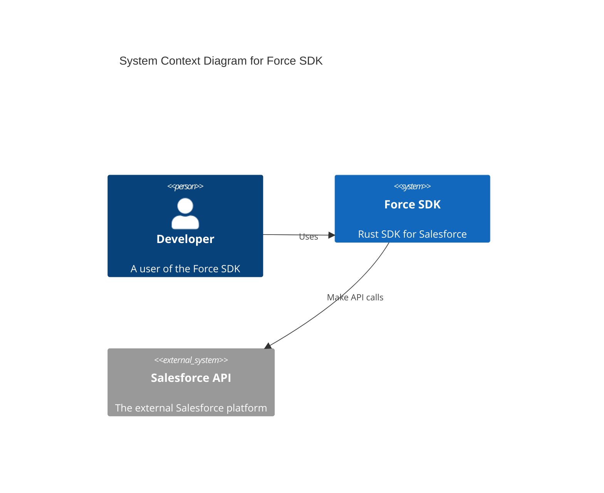
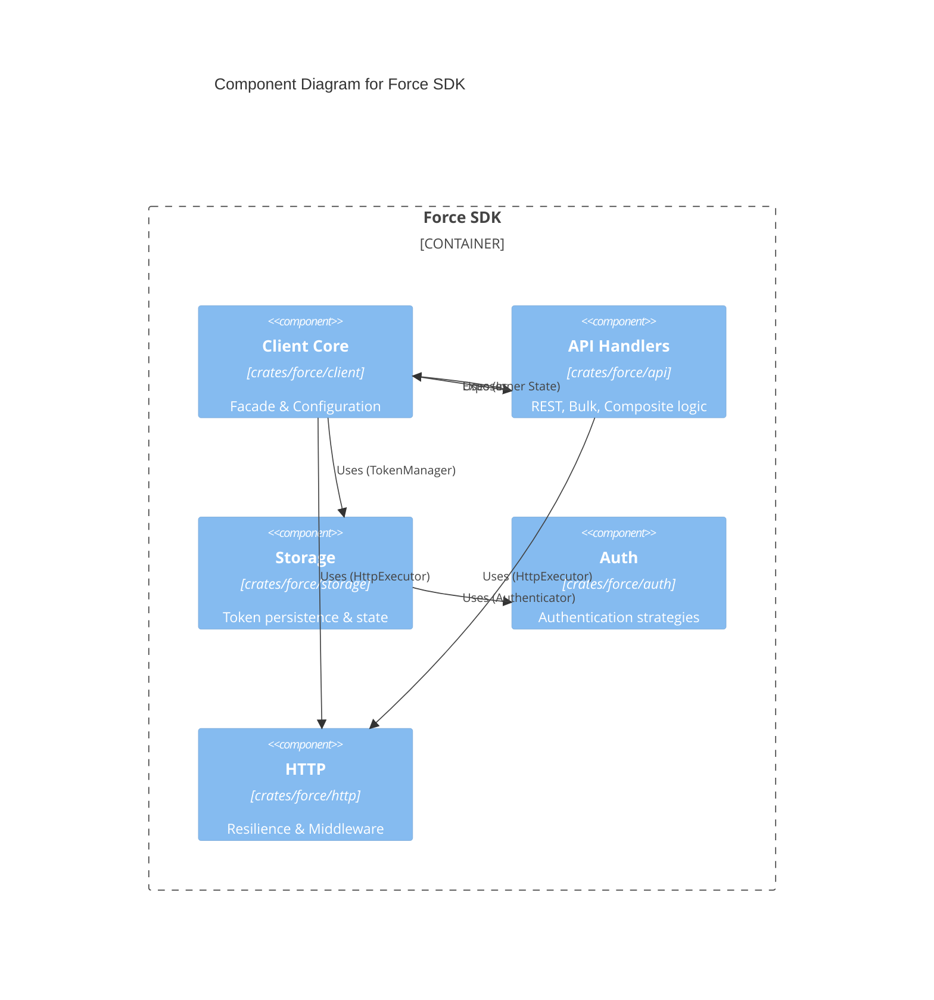
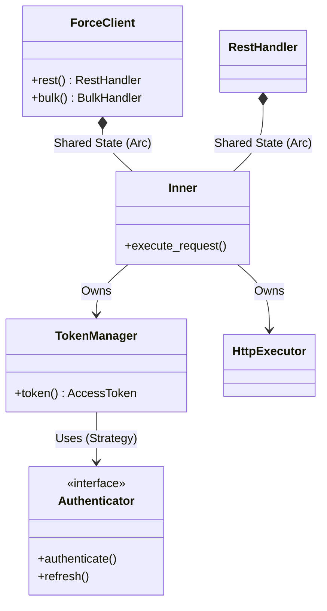
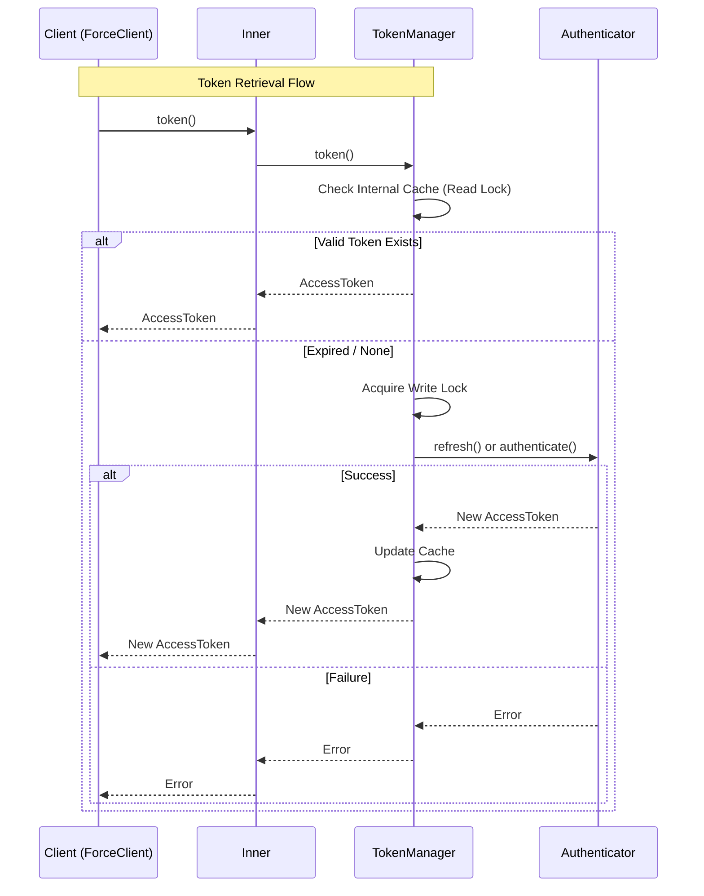
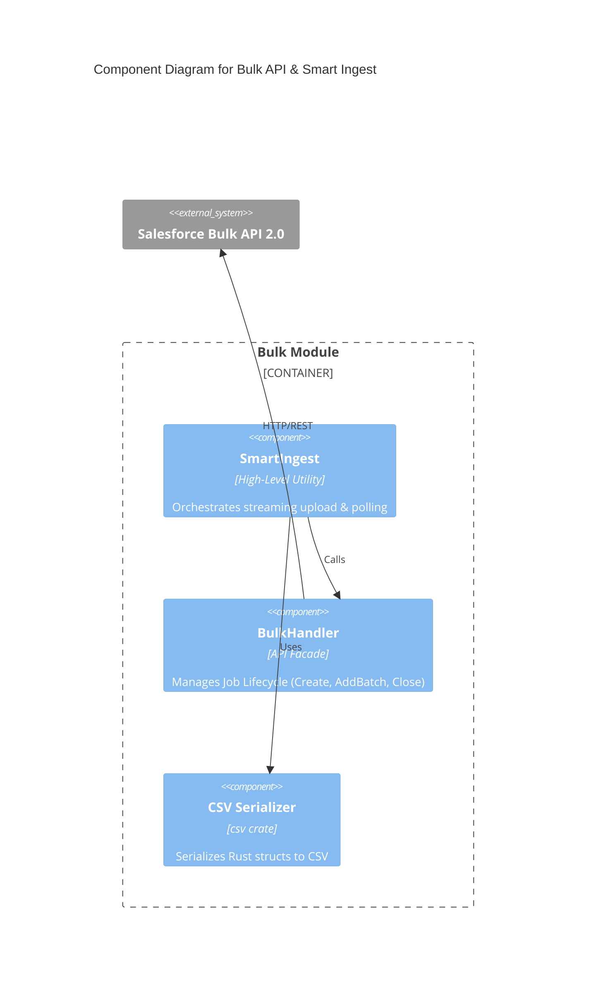
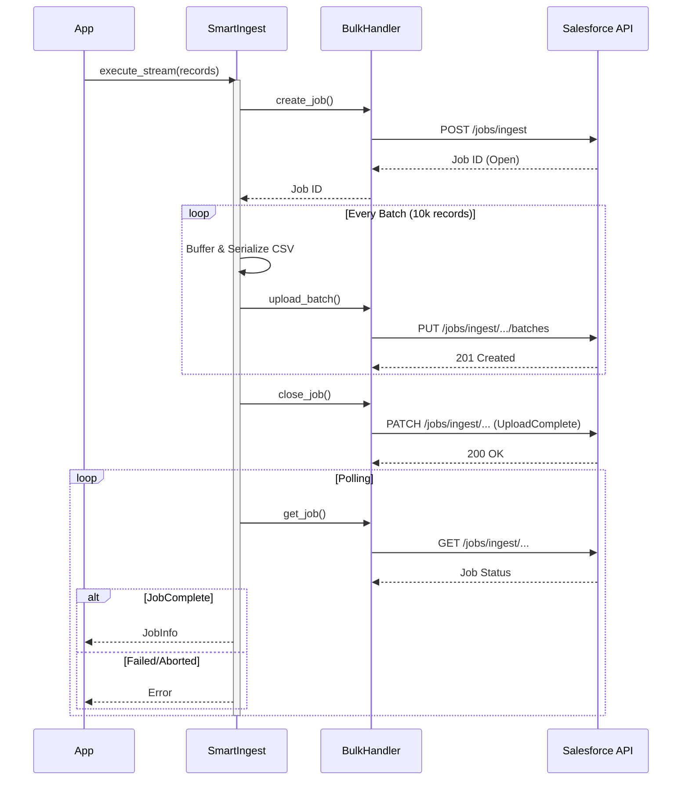

# Architecture Documentation

This document describes the high-level architecture of the Force SDK.

## C4 Context Diagram

## C4 Component Diagram

The following diagram illustrates the internal module structure and dependencies. Note that the `Storage` module is decoupled from the core `Client` logic.

## Class Diagram

The core library uses an `Inner` struct pattern for shared state and thread safety, decoupled from storage via the `TokenManager`.

## Sequence Diagram: Token Storage

The following sequence diagram illustrates how the Client interacts with the TokenManager to retrieve and persist authentication tokens.

## C4 Component Diagram: Bulk API & Smart Ingest

The Bulk API module includes a high-level utility `SmartIngest` that orchestrates the complex lifecycle of bulk jobs.

## Sequence Diagram: Smart Ingest Lifecycle

The following sequence diagram illustrates the `SmartIngest::execute_stream` workflow, handling chunking, uploading, and polling.

