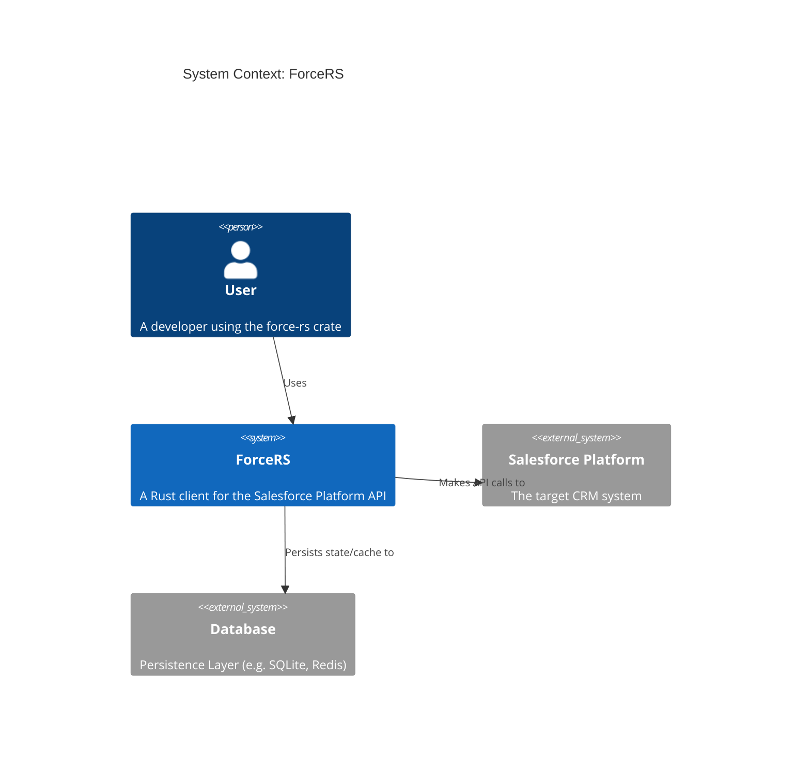
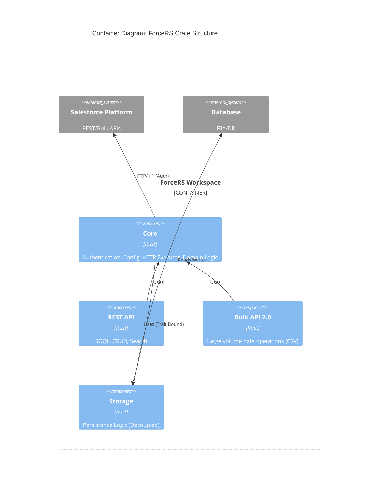
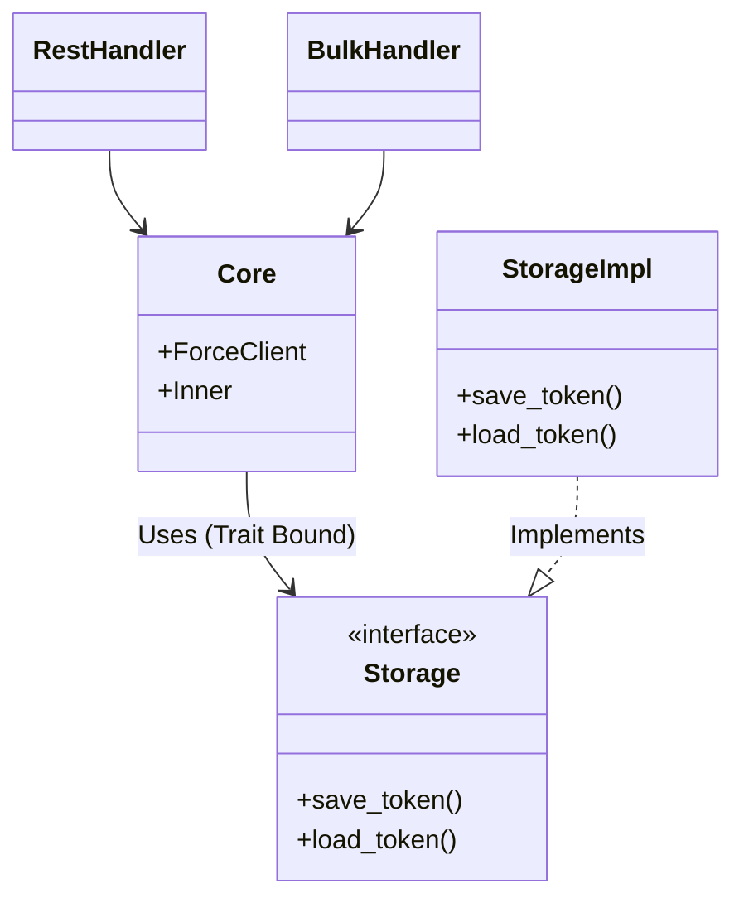
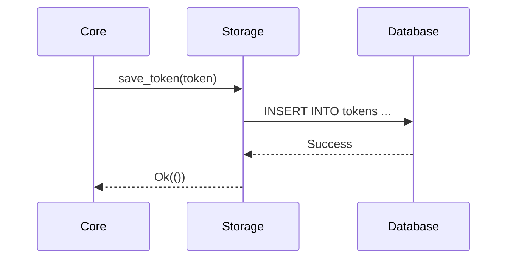

# ForceRS Architecture

This document describes the high-level architecture of the `force-rs` crate, including the decoupled storage module.

## System Context (C4 Level 1)

## Container Diagram (C4 Level 2)

## Component Design (Classes)

## Storage Sequence Flow

