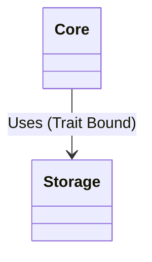
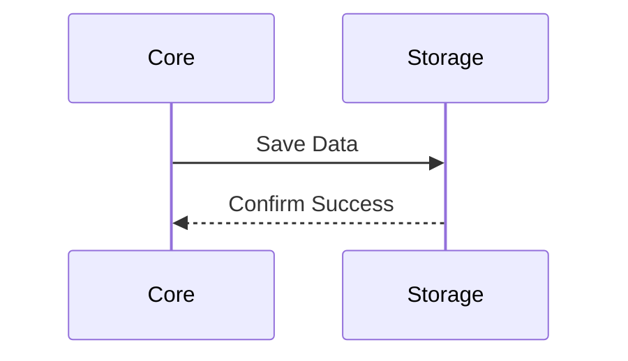

# System Architecture

This document describes the high-level architecture of `force-rs`.

## Class Diagram

The following class diagram illustrates the decoupled relationship between the Core logic and the Storage mechanism.

## Sequence Diagram

The following sequence diagram illustrates the flow of data persistence.

