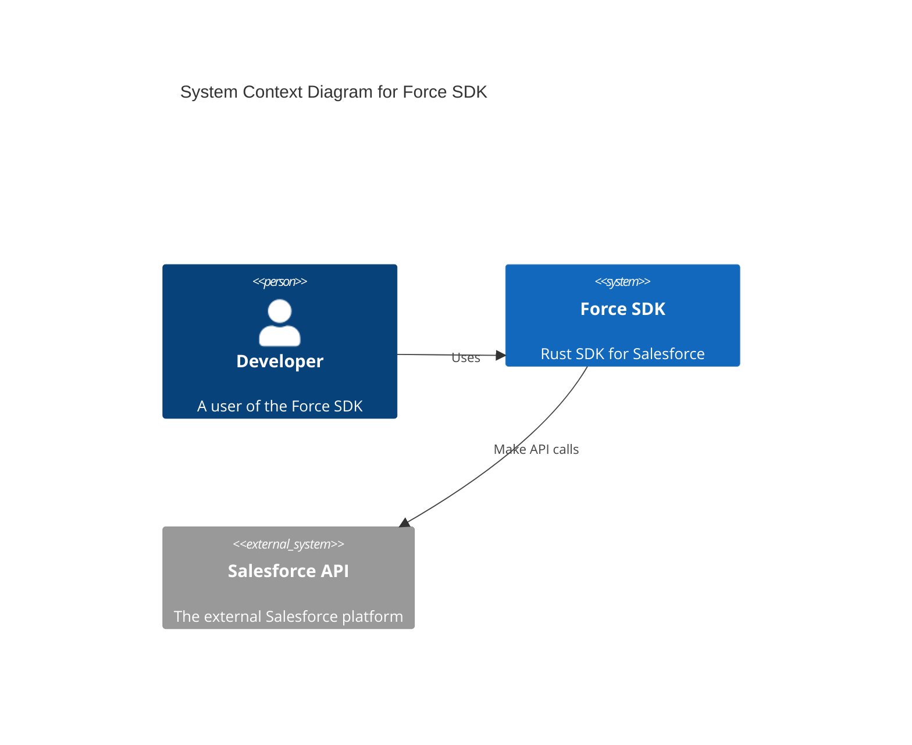
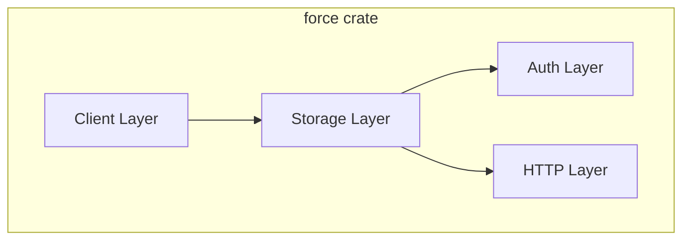
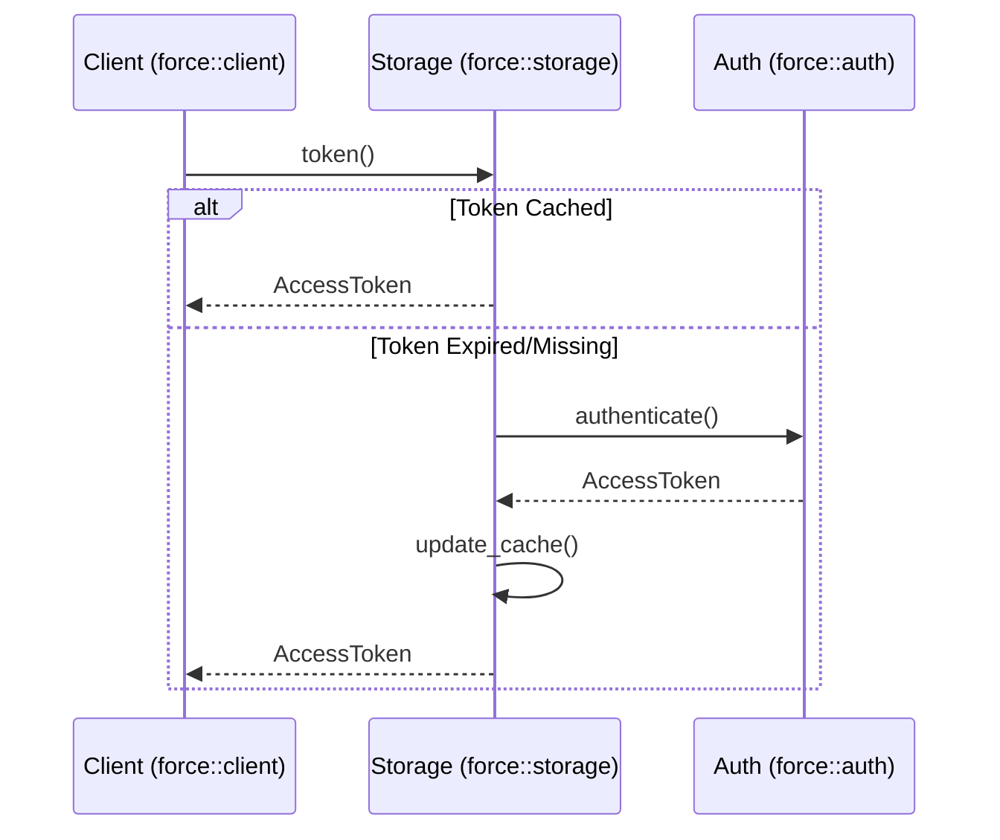

# Architecture Documentation

This document describes the high-level architecture of the Force SDK.

## C4 Context Diagram

## Internal Architecture

The `force` crate is organized into modular components.

## Sequence Diagram: Token Storage

The following sequence diagram illustrates how the Client interacts with the Storage layer (TokenManager) to persist authentication tokens.

