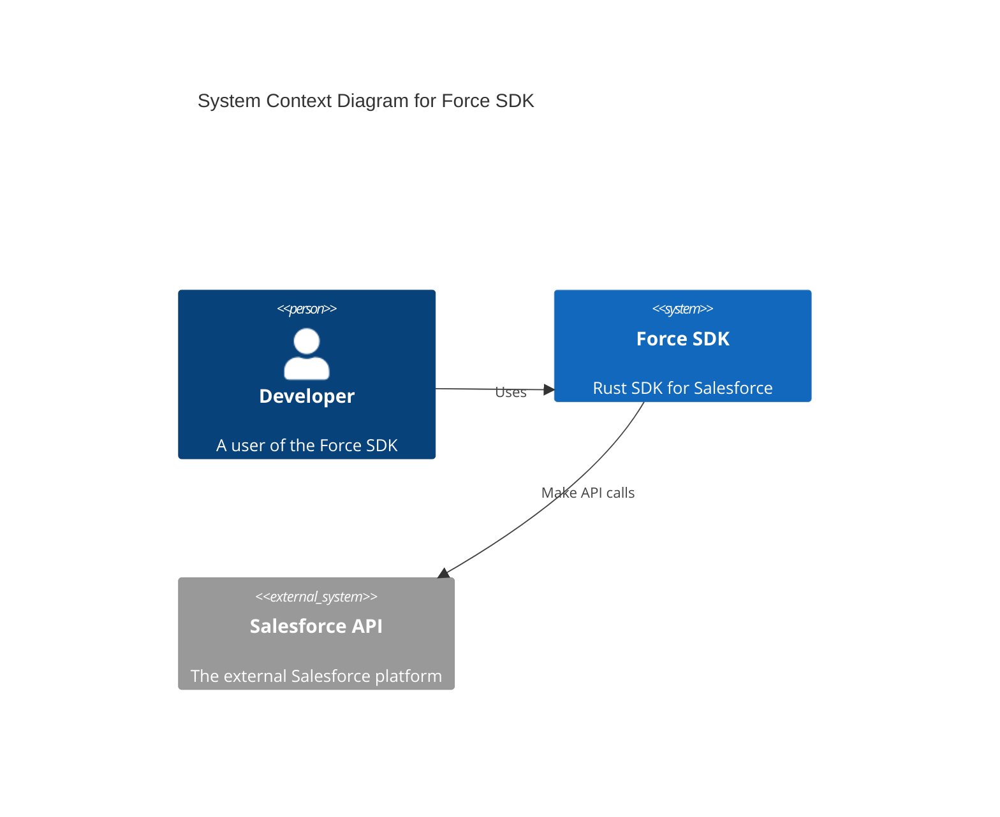
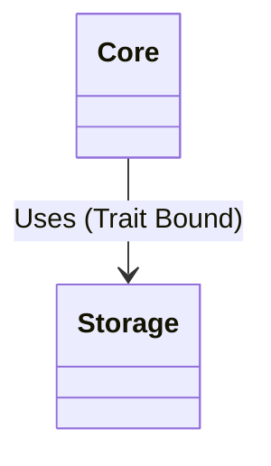
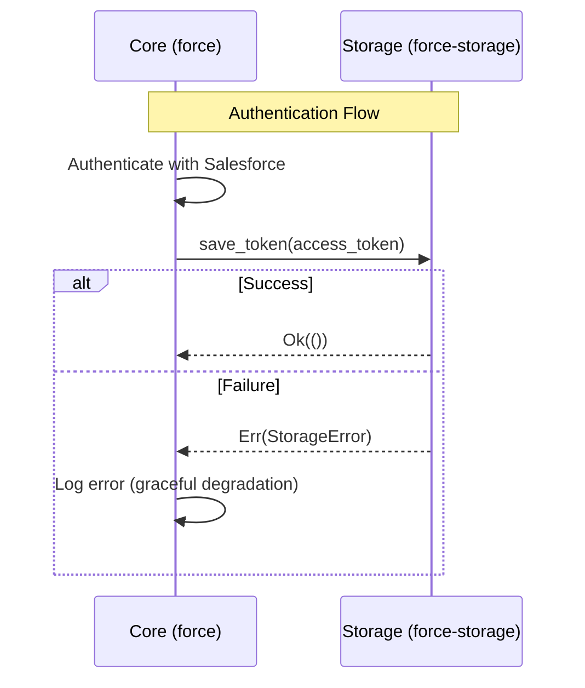

# Architecture Documentation

This document describes the high-level architecture of the Force SDK.

## C4 Context Diagram

## Class Diagram

The core library is decoupled from concrete storage implementations via traits.

## Sequence Diagram: Token Storage

The following sequence diagram illustrates how the Core interacts with the Storage layer to persist authentication tokens.

