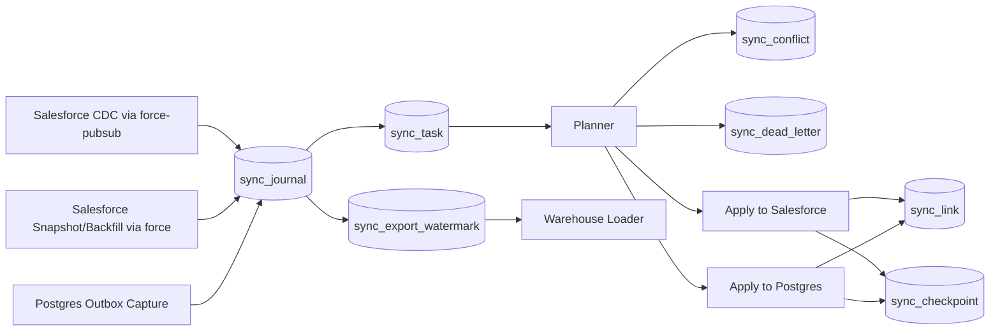

# Force Sync Design

**Date:** 2026-03-25
**Status:** Proposed

## Overview

`force-sync` is a new workspace crate for high-correctness bidirectional sync between Salesforce and PostgreSQL.

It is not a generic sync framework and not a warehouse connector. Its first job is:

- converge Salesforce and PostgreSQL safely
- survive retries, duplicate delivery, restarts, and partial failures
- keep enough history to support replay, anti-entropy, and downstream warehouse export

The design is Postgres-first, correctness-first, and transport-adaptive.

## Core Decisions

1. `force-sync` is its own crate in the `force-rs` workspace.
2. PostgreSQL is the primary and only v0.1 backend.
3. Canonical identity is `(tenant, object_name, external_id)`.
4. Salesforce IDs and local row IDs are aliases, not primary identity.
5. PostgreSQL is both the control plane and the durable recovery source.
6. `force-sync` stores both append-only journal history and current operational link state.
7. The engine uses a planner to choose the cheapest safe apply lane:
   - REST
   - Composite Graph
   - Bulk
8. Warehouse delivery is not part of v0.1, but the Postgres schema is designed to support downstream incremental export.
9. Diesel is out. Prefer explicit SQL with an async-native Postgres client.

## Non-Goals

- No SQLite backend in v0.1
- No direct Snowflake/BigQuery/Databricks sinks in v0.1
- No generic plugin ecosystem
- No automatic modeling of arbitrary user business tables
- No operator UI in v0.1

## Why Its Own Crate

`force` and `force-pubsub` expose Salesforce transports and API surfaces. `force-sync` is different: it owns durable sync state, conflict policy, checkpoints, retry semantics, and reconciliation.

That is a separate responsibility boundary and deserves a separate crate.

## Architecture



## Crate Shape

The initial crate should be layered, not pre-shattered into many micro-crates:

```text
crates/force-sync/
  src/
    lib.rs
    config/
    identity/
    model/
    capture/
      salesforce.rs
      postgres.rs
    store/
      pg/
    plan/
    apply/
      salesforce.rs
      postgres.rs
    reconcile/
    telemetry/
```

### Module Responsibilities

- `config`
  - orgs, objects, field maps, ownership rules, thresholds, retry policy
- `identity`
  - `SyncKey`, external-ID mapping, canonical aliases
- `model`
  - `ChangeEnvelope`, `SourceCursor`, `MergeDecision`, `Conflict`, `Tombstone`
- `capture::salesforce`
  - CDC, snapshot, backfill windows
- `capture::postgres`
  - transactional outbox capture
- `store::pg`
  - journal writes, task leasing, checkpoints, links, conflicts, dead letters
- `plan`
  - merge logic and transport selection
- `apply::salesforce`
  - REST upsert, Composite Graph, Bulk ingest/delete
- `apply::postgres`
  - target-table apply and shadow-state maintenance
- `reconcile`
  - anti-entropy, hash drift repair, replay tools
- `telemetry`
  - tracing, metrics, lag accounting

## Runtime Model

The runtime is intentionally boring:

1. capture changes from both sides
2. write them durably to the journal
3. enqueue apply work
4. merge against shadow/link state
5. choose the safest transport lane
6. apply idempotently
7. advance checkpoints only after durable success
8. run anti-entropy independently

## Canonical Identity

The sync engine must not anchor correctness on Salesforce IDs.

Canonical key:

```text
(tenant, object_name, external_id)
```

Implications:

- all steady-state upserts target external ID
- Salesforce IDs are refreshed and cached when known
- local primary keys are tracked as aliases
- relinking and repair remain possible after ID churn or environment refreshes

## Postgres Control Plane

Postgres stores two categories of state:

- append-only truth
- operational sync state

### Tables

#### `sync_journal`

Append-only log of all captured changes.

Suggested columns:

- `journal_id bigserial primary key`
- `tenant text not null`
- `object_name text not null`
- `external_id text not null`
- `source text not null`
- `source_cursor text not null`
- `observed_at timestamptz not null`
- `op text not null`
- `tombstone boolean not null default false`
- `payload jsonb not null`
- `payload_hash bytea not null`
- `schema_version integer not null`
- `created_at timestamptz not null default now()`

Suggested constraints:

- unique on `(source, source_cursor)`

#### `sync_link`

Current per-record shadow/link state.

Suggested columns:

- `tenant text not null`
- `object_name text not null`
- `external_id text not null`
- `salesforce_id text`
- `local_pk text`
- `last_sf_cursor text`
- `last_pg_cursor text`
- `last_merged_hash bytea`
- `deleted boolean not null default false`
- `updated_at timestamptz not null default now()`

Suggested constraints:

- primary key `(tenant, object_name, external_id)`

#### `sync_task`

Durable work queue.

Suggested columns:

- `task_id bigserial primary key`
- `journal_id bigint`
- `task_kind text not null`
- `status text not null`
- `priority integer not null`
- `lease_owner text`
- `lease_until timestamptz`
- `attempt_count integer not null default 0`
- `next_attempt_at timestamptz not null default now()`
- `last_error text`
- `created_at timestamptz not null default now()`
- `updated_at timestamptz not null default now()`

#### `sync_checkpoint`

Per-stream progress tracking.

Suggested columns:

- `checkpoint_key text primary key`
- `cursor text not null`
- `updated_at timestamptz not null default now()`

Examples:

- Salesforce topic replay cursor
- snapshot/backfill watermark
- Postgres outbox sequence or LSN

#### `sync_conflict`

Field-level unresolved merge conflicts.

Suggested columns:

- `conflict_id bigserial primary key`
- `journal_id bigint not null`
- `tenant text not null`
- `object_name text not null`
- `external_id text not null`
- `field_name text not null`
- `reason text not null`
- `left_value jsonb`
- `right_value jsonb`
- `status text not null default 'open'`
- `created_at timestamptz not null default now()`

#### `sync_dead_letter`

Terminal failures for replay/debug.

Suggested columns:

- `dead_letter_id bigserial primary key`
- `journal_id bigint`
- `task_id bigint`
- `error_class text not null`
- `error_message text not null`
- `context jsonb not null`
- `created_at timestamptz not null default now()`

#### `sync_export_watermark`

Monotonic export cursor for downstream warehouse loaders.

Suggested columns:

- `export_key text primary key`
- `last_journal_id bigint not null`
- `updated_at timestamptz not null default now()`

### Indexes

Focus on the real access paths:

- exact identity lookup
  - `(tenant, object_name, external_id)`
- worker leasing
  - `(status, next_attempt_at, lease_until, priority)`
- export/reconcile scans
  - `(journal_id)`
  - `(object_name, observed_at)`

Avoid over-indexing early. This is a write-heavy control plane.

## Planner

The planner is the brain of the engine.

It does two jobs:

1. determine merged truth
2. choose the cheapest safe apply lane

### Merge Phase

Inputs:

- incoming `ChangeEnvelope`
- current `sync_link`
- object config
- field ownership policy

Rules:

- drop no-op changes by hash
- suppress loops using source markers and last-seen cursors
- apply field ownership:
  - Salesforce-owned
  - Postgres-owned
  - mergeable
  - conflict-required
- write unresolved cases to `sync_conflict`

### Transport Phase

#### REST lane

Use for:

- small urgent singleton changes
- idempotent upserts by external ID

#### Composite Graph lane

Use for:

- dependent object trees
- cases that need local transactional grouping on the Salesforce side

#### Bulk lane

Use for:

- backfills
- repair jobs
- large homogeneous batches
- backlog draining

#### Delete lane

Use tombstones internally first, then choose:

- REST delete for singletons
- bulk delete for large sets

### Important Constraint

Steady-state correctness must not depend on Salesforce returning a record ID from upsert updates. Current `force` semantics have a `204` sharp edge for update responses without an ID, so external ID must be sufficient for convergence.

## Public API

Public API should expose an engine, not an ORM:

```rust
let engine = force_sync::SyncEngine::builder()
    .postgres(pool)
    .salesforce(client, pubsub)
    .object(
        ObjectSync::new("Account")
            .external_id("External_Id__c")
            .conflict_policy(ConflictPolicy::field_owned([
                ("Name", Owner::Salesforce),
                ("Description", Owner::Postgres),
            ]))
            .bulk_threshold(500)
    )
    .build()
    .await?;
```

Suggested runtime entrypoints:

- `run_capture_salesforce()`
- `run_capture_postgres()`
- `run_apply()`
- `run_reconcile()`
- `run_all()`

### Key Public Types

- `SyncEngine`
- `ObjectSync`
- `ChangeEnvelope`
- `ConflictPolicy`
- `MergeDecision`
- `SyncStats`
- `ReplayHandle`

## Warehouse Posture

Enterprise warehouse demand is real, but direct warehouse sinks do not belong in v0.1.

Design for them by making Postgres warehouse-friendly:

- keep append-only journal history
- preserve monotonic export order
- retain payload hashes, cursors, and timestamps
- support downstream incremental export by `journal_id`

Recommended flow:

```text
Salesforce <-> force-sync <-> Postgres -> ELT/loader -> Warehouse
```

This keeps `force-sync` focused on convergence and correctness while allowing warehouse loaders to consume either:

- current-state tables
- journal history
- both

## Database Layer Choice

Postgres is the right v0.1 backend because this is a concurrency-heavy control-plane problem:

- durable journal
- leased work queue
- checkpoints
- conflicts
- dead letters
- multi-worker apply loops
- anti-entropy scans
- transactional outbox capture

Diesel is not recommended for this crate. `force-sync` is not ORM-shaped work. Prefer explicit SQL with an async-native Postgres client.

Preferred direction:

- `tokio-postgres` plus a pool
- optionally `sqlx` if compile-time query checking proves worth the added surface

Do not design around lowest-common-denominator SQL for hypothetical SQLite parity.

## Testing Strategy

Follow the repo's proof-and-test discipline.

### Verified Core

Keep the verified core small and deterministic.

Good candidates for Verus specs/proofs:

- checkpoint monotonicity
- idempotent dedupe key behavior
- merge-policy determinism
- lease state transitions for tasks
- loop-suppression invariants

Do not try to formally verify the entire I/O runtime. Verify the rules spine and test the transport glue.

### Unit Tests

Focus on pure logic:

- identity mapping
- merge policy
- planner selection
- hash/no-op suppression
- cursor progression
- delete/tombstone behavior

### Property Tests

Use property tests for:

- duplicate delivery
- out-of-order event sequences
- conflict-policy symmetry and asymmetry
- replay safety after restart
- planner invariants under varied batch sizes and latencies

### Integration Tests

Need end-to-end tests for:

- Salesforce REST apply flows using existing mocking patterns
- Pub/Sub replay/resume behavior
- Postgres journal + task leasing + checkpoint advancement
- worker crash before and after checkpoint commit
- bulk partial failures and repair
- reconcile windows and drift healing

### Failure Injection

Explicitly test:

- duplicate CDC delivery
- CDC retention gaps
- transient Salesforce 5xx
- `204` upsert update path
- lease expiration / worker death
- dead-letter routing
- schema drift
- delete then recreate with same external ID

## v0.1 Scope

### Include

- Postgres-only backend
- Salesforce CDC capture
- Salesforce snapshot/backfill
- Postgres transactional outbox capture
- REST external-ID upsert lane
- bulk upsert/delete lane
- reconcile jobs
- conflict and dead-letter handling
- tracing/metrics hooks

### Exclude

- SQLite backend
- direct warehouse sinks
- plugin system
- operator UI
- logical decoding as the first Postgres capture mode
- giant config DSL

## Implementation Order

Build a narrow vertical slice before widening.

### Phase 1

- create crate
- define core model types
- add Postgres schema and migrations
- implement journal write/read
- implement task leasing

### Phase 2

- implement one-object sync config
- implement merge policy engine
- implement planner
- implement Postgres outbox capture

### Phase 3

- implement Salesforce REST apply lane
- make one object sync end-to-end through external-ID upsert
- add no-op suppression and checkpoints

### Phase 4

- implement Salesforce CDC capture via `force-pubsub`
- add replay resume
- add duplicate and restart safety tests

### Phase 5

- implement bulk lane
- add reconcile/anti-entropy
- add conflict and dead-letter workflows

### Phase 6

- add Composite Graph lane
- optimize batching and throughput
- tune indexes and worker concurrency

## Risks

- underestimating schema drift and field mapping pain
- overfitting planner rules before collecting metrics
- building too much backend abstraction too early
- mixing warehouse requirements into sync correctness logic
- depending on Salesforce IDs instead of external IDs

## Recommendation

Ship `force-sync` as a serious, Postgres-first sync engine with:

- external-ID canonical identity
- append-only journal
- durable task queue
- field-aware conflict policy
- planner-driven transport selection
- downstream-friendly history for future warehouse export

That is the simplest architecture that still deserves to be trusted.
